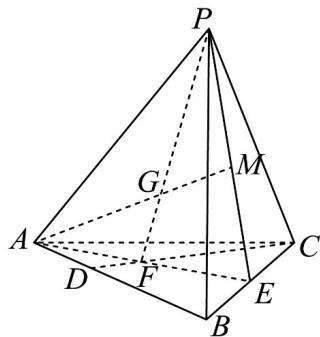

> [!faq]- 《专题02_空间向量基本定理_三大题型__高效培优期中专项训练_数学人教》官方解析
>
> > [!success]- **【答案】** (1) $\lambda=1$ ; (2) $\frac{1}{6}$ ; (3) $\sqrt{2}$ .
>
> > [!note]- **【分析】**
> > （1）设 $\overline{BF}=\frac{3}{2}x\overline{BD}+y\overline{BC}$ 得 $\frac{3}{2}x+y=1$ ，同理得 $x+2y=1$ ，联立求参数，即得 $\overline{BF}=\frac{1}{2}\overline{BA}+\frac{1}{2}\overline{BE}$ 有AF=FE，即可得；
> >
> > (2) 连接 $PE$ ， $MF$ ， $M \in PE$ ，证明 $M$ 为 $PE$ 中点，根据已知及等体积法，应用棱锥的体积公式求体积；
> >
> > (3) 由 $S_{\triangle ABC} = 2\sqrt{2}\sin \angle BAC \leq 2\sqrt{2}$ ，设 $PA = x$ ， $PC = y$ ， $\angle APC = \theta$ ， $AC$ 边上的高为 $h$ ，得到 $h = \sqrt{xy - 2}$ ，应用基本不等式得 $h \leq \sqrt{2}$ ，设三棱锥 $P - ABC$ 的高为 $H$ ，则 $H \leq h$ ，故 $V_{P - ABC} = \frac{1}{3} S_{ABC}H \leq \frac{1}{3} S_{ABC}h$ ，并确定取最大值对应的三棱锥 $P - ABC$ 的高·
>
> > [!note]- **【解析】**
> > （1）设 $BF = xBA + yBC = \frac{3}{2} xBD + yBC$
> >
> > ∵F，D，C三点共线，故 $\frac{3}{2}x+y=1①$ ，
> >
> > 同理 $BF = xBA + yBC = xBA + 2yBE$
> >
> > ∵A，F，E三点共线，故 $x+2y=1$ ②，
> >
> > 由①②可得 $x=\frac{1}{2}$ ， $y=\frac{1}{4}$ ，故 $\overline{BF}=\frac{1}{2}\overline{BA}+\frac{1}{2}\overline{BE}$ ，
> >
> > 故 F 为 AE 中点，故 AF = FE ，即 $\lambda = 1$ .
> >
> > (2) 连接 $PE$ ， $M \in AG$ ， $AG \subset$ 平面 $PAE$ ， $\therefore M \in$ 平面 $PAE$ 又 $M \in$ 平面 $PBC$ ，且平面 $PAE \cap$ 平面 $PBC = PE$ ， $\therefore M \in PE$
> >
> > 
> >
> > 连接MF，
> >
> > 在 $\triangle GAP$ 和 $\triangle GMF$ 中， $\frac{AG}{GM} = \frac{PG}{GF}$ ，且 $\angle AGP = \angle MGF$
> >
> > 故 $\triangle GAP \sim \triangle GMF$ ，故 $\angle GAP = \angle GMF$ ，故 $AP // MF$ ，
> >
> > 又 F 为 AE 中点，故 M 为 PE 中点，
> >
> > $$
> > V _ {P - F B M} = V _ {F - P B M} = \frac {1}{3} S _ {\triangle P B M} h _ {F - P B M} = \frac {1}{3} \times \left(\frac {1}{4} S _ {\triangle P B C}\right) \times \left(\frac {1}{2} h _ {A - P B M}\right)
> > $$
> >
> > $= \frac{1}{8}\times \frac{1}{3} S_{\triangle PBC}h_{A - PBC} = \frac{1}{8}\times \frac{4}{3} = \frac{1}{6}$
> >
> > (3) $S_{\triangle ABC} = \frac{1}{2} AC \cdot AB \cdot \sin \angle BAC = 2\sqrt{2} \sin \angle BAC \leq 2\sqrt{2}$ ，当 $\angle BAC = 90^{\circ}$ 时，取到等号，
> >
> > 在 $\triangle PAC$ 中，设 $PA = x$ ， $PC = y$ ， $\angle APC = \theta$ ， $AC$ 边上的高为 $h$
> >
> > $$
> > \cos \theta = \frac {x ^ {2} + y ^ {2} - 8}{2 x y} = \frac {(x + y) ^ {2} - 2 x y - 8}{2 x y} = \frac {8 - 2 x y}{2 x y} = \frac {4 - x y}{x y}
> > $$
> >
> > 则 $\sin \theta = \frac{\sqrt{x^2y^2 - (4 - xy)^2}}{xy} = \frac{\sqrt{8xy - 16}}{xy}$ ，则 $\frac{1}{2} AC\times h = \frac{1}{2} xy\sin \theta$
> >
> > 故 $h = \frac{xy\sin\theta}{AC} = \frac{\sqrt{8xy - 16}}{2\sqrt{2}} = \sqrt{xy - 2}$
> >
> > 又 $x + y = 4$ $2\sqrt{xy}\Rightarrow xy\leq 4$ ，故 $h = \sqrt{xy - 2}\leq \sqrt{2}$ ，当且仅当 $x = y = 2$ 时取到最大值
> >
> > 设三棱锥 P-ABC 的高为 H，则 $H \leq h$ ，则 $V_{P-ABC} = \frac{1}{3} S_{ABC} H \leq \frac{1}{3} S_{ABC} h \leq \frac{1}{3} \times 2\sqrt{2} \times \sqrt{2} = \frac{4}{3}$
> >
> > 当 $\angle BAC = 90^{\circ}$ ， $PA = PB = 2$ 且 $H = h$ 时取等号，故三棱锥 $P - ABC$ 的高为 $H = \sqrt{2}$
