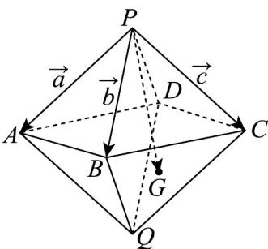
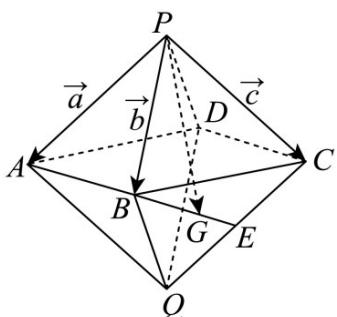

> [!faq]- 《专题02_空间向量基本定理_三大题型__高效培优期中专项训练_数学人教》官方解析
>
> > [!success]- **【答案】** B
>
> > [!note]- **【分析】**
> > 根据空间向量基底的概念，空间的一组基底，必须是不共面的三个向量求解判断各个选项。
>
> > [!note]- **【解析】**
> > 对于 A，设 $a + b = x(c + b) + y(a - c)$ ，即 $a + b = x(c + b) + y(a - c) = ya + xb + (x - y)c$ ，解得 x = y = 1，
> > 所以 $a + b, c + b, a - c$ 共面，不能构成空间的一个基底，故 A 错误；
> > 对于 B，设 $a + 2b = xb + y(a - c)$ ，x, y 无解，
> > 所以 $a + 2b, b, a - c$ 不共面，能构成空间的一组基底，故 B 正确；
> > 对于 C，设 $2a + b = x(2c + b) + y(a + b + c)$ ，解得 $\left\{\begin{aligned}x&=-1\\ y&=2\end{aligned}\right.$ 所以 $2a+b,2c+b,a+b+c$ 共面，不能构成空间的一个基底，故 C 错误；
> > 对于 D，设 $a+b = x(a+b+c) + yc$ ，解得 $\left\{\begin{aligned}x &= 1 \\ y &= -1\end{aligned}\right.$ 所以 $a+b, a+b+c, c$ 共面，不能构成空间的一个基底，故 D 错误
> > 故选：B.
> >
> > 29. 六氟化硫，化学式为 $\mathrm{SF}_6$ ，常压下是一种无色、无臭、无毒、不燃的稳定气体，有良好的绝缘性，在电器工业方面具有广泛用途·六氟化硫分子结构为正八面体结构（正八面体每个面都是正三角形，可以看作是两个棱长均相等的正四棱锥将底面重合的几何体）·如图所示，在正八面体 $P - ABCD - Q$ 中， $G$ 是 $\triangle BCQ$ 的重心，记 $PA = a$ ， $PB = b$ ， $PC = c$ ，则 $PG$ 等于（ ）
> >
> > 
> >
> > A. $-\frac{1}{3} a + \frac{1}{3} b + \frac{2}{3} c$ B. $\frac{1}{3} a - \frac{1}{3} b + \frac{2}{3} c$ C. $\frac{1}{3} a - \frac{1}{3} b - \frac{2}{3} c$ D. $\frac{1}{3} a + \frac{1}{3} b + \frac{2}{3} c$
> >
> > 【答案】D
> >
> > 【分析】由空间向量的线性运算求解即可·
> >
> > 【详解】易知 $PD = BQ = a + c - b$ ，设 $CQ$ 中点为 $E$
> >
> > $$
> > \boxed {\square \square} B G = \frac {2}{3} \boxed {\square \square} B E = \frac {1}{3} \left(\boxed {\square \square} B Q + \boxed {\square \square} B C\right) = \frac {1}{3} \left(\boxed {\square \square} B Q + \boxed {\square \square} P C - \boxed {\square \square} P B\right) = \frac {1}{3} \left(a - 2 b + 2 c\right)
> > $$
> >
> > 所以 $PG = PB + BG = b + \frac{1}{3} (a - 2b + 2c) = \frac{1}{3} a + \frac{1}{3} b + \frac{2}{3} c$
> >
> > 
> >
> > 故选 **D**.
