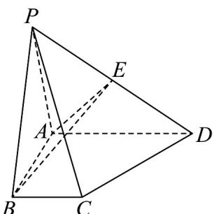

> [!faq]- 《专题03_空间向量及其运算的坐标表示_五大题型__高效培优期中专项训练》官方解析
>
> > [!success]- **【答案】**  A. $\frac{5}{12}$ B. $\frac{1}{2}$ C. $\frac{2}{3}$ D. $\frac{3}{4}$
>
> > [!note]- **【分析】**
> > 根据空间向量基本定理，选择 $\left\{ \begin{array}{lll} \square & \square & \square \\ PA, AB, AD \end{array} \right\}$ 作为基底分别表示 $PF$ 和 $PC$ 向量，再根据向量共线的条件 $PF = \lambda PC$ 求出参数 $\lambda$ 即可·
>
> > [!note]- **【解析】**
> > 选择 $\left\{ \begin{array}{lll} \square & \square & \square \\ PA, AB, AD \end{array} \right\}$ 作为基底， $PC = PA + AB + BC = PA + AB + \frac{1}{2} AD$ ； $PF = PA + AF$ ，由已知 $F$ 点在平面 $ABE$ 内，即 $AF$ 与 $AB$ ， $AE$ 共面，可得 $AF = mAB + nAE$ ，又由 $E$ 是 $PD$ 的中点，可得 $AE = \frac{1}{2} AP + \frac{1}{2} AD$ ，代换可得： $\square PF = (1 - \frac{1}{2} n)PA + mAB + \frac{1}{2} nAD$ ； $\square PF$ 与 $PC$ 共线，即 $PF = \lambda PC$ ，可得： $\square PF = \lambda PA + \lambda AB + \frac{1}{2} \lambda AD$ ，即 $\left\{ \begin{array}{l} \lambda = 1 - \frac{1}{2} n \\ \lambda = m \\ \frac{1}{2} \lambda = \frac{1}{2} n \end{array} \right.$ ，解得。
> >
> > 故选 **C**
