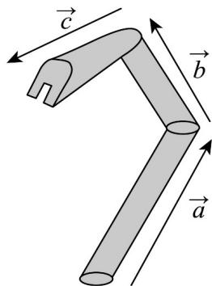

> [!faq]- 《专题03_空间向量及其运算的坐标表示_五大题型__高效培优期中专项训练》官方解析
>
> > [!success]- **【答案】** 
>
> > [!note]- **【分析】**
> > 根据向量的模的坐标公式即可求出结果·
>
> > [!note]- **【解析】**
> > 由题意可知， $d=a+b+c=(2,3,4)+(1,-1,3)+(4,-1,-3)=(7,1,4)$ .
> >
> > 所以 $\left|d\right|=\sqrt{7^{2}+1^{2}+4^{2}}=\sqrt{66}$
> >
> > 故答案为： $\sqrt{66}$
