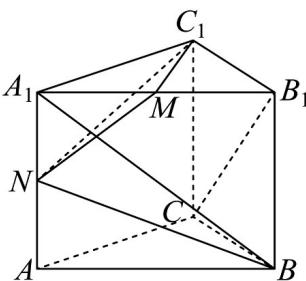

<!-- question-source:start -->
3. 如图，在直三棱柱 $ABC - A_{1}B_{1}C_{1}$ 中， $CA = CB = 1, \angle BCA = 90^{\circ}$ ，棱 $AA_{1} = 2$ ， $M, N$ 分别为 $A_{1}B_{1}, A_{1}A$ 的中点。

(1)求 $BN$ 的长；

(2)求 $BA_{1}$ 与 $CB_{1}$ 夹角的余弦值；

(3)求证： $BN$ 是平面 $C_1MN$ 的一个法向量.
<!-- question-source:end -->

![[高中/课堂同步/题库/人教A版高中数学同步讲义(2026)/03_选择性必修第一册/期中专项训练+期中模拟卷/专项训练/专题04_空间向量的应用_五大题型__高效培优期中专项训练_数学人教A/_compact/answers/Q00062214A1.md]]
