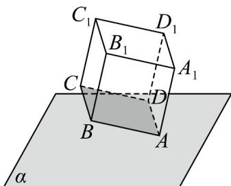

<!-- question-source:start -->
14. 如图，边长为 $2$ 的正方体的一个顶点 $A$ 在平面 $\alpha$ 内，其余顶点在 $\alpha$ 的同侧，且点 $B$ 和点 $D$ 到平面 $\alpha$ 的距离均为 $\frac{\sqrt{2}}{2}$ ，则平面 $A_{1}C_{1}D$ 与平面 $\alpha$ 的夹角的余弦值为（）

A. $\frac{1}{2}$ B. $\frac{\sqrt{2}}{2}$ C. $\frac{1}{3}$ D. $\frac{\sqrt{6}}{6}$
<!-- question-source:end -->

![[高中/课堂同步/题库/人教A版高中数学同步讲义(2026)/03_选择性必修第一册/期中专项训练+期中模拟卷/专项训练/专题04_空间向量的应用_五大题型__高效培优期中专项训练_数学人教A/_compact/answers/Q00062224A1.md]]
