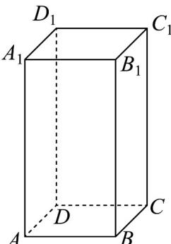

<!-- question-source:start -->
15. 如图，在正四棱柱 $ABCD - A_{1}B_{1}C_{1}D_{1}$ 中，底面边长为 1，侧棱长为 2， $M$ 是上底面 $A_{1}B_{1}C_{1}D_{1}$ 内（包括边界）的动点， $N$ 是侧棱 $DD_{1}$ 上的动点，则下列结论正确的是（）

A. $A_{1}N + NC$ 的最小值为 $2\sqrt{2}$ B.若 $BM / /$ 平面 $ACD_{1}$ ，则点 $M$ 的轨迹的长度为 $\sqrt{2}$ C.若 $A_{1}N\bot BD_{1}$ ，则点 $N$ 是 $DD_{1}$ 的中点
D.若 $AM = \sqrt{5}$ ，则点 $M$ 的轨迹的长度为 $\frac{\pi}{2}$
<!-- question-source:end -->

![[高中/课堂同步/题库/人教A版高中数学同步讲义(2026)/03_选择性必修第一册/期中专项训练+期中模拟卷/专项训练/专题04_空间向量的应用_五大题型__高效培优期中专项训练_数学人教A/_compact/answers/Q00062225A1.md]]
