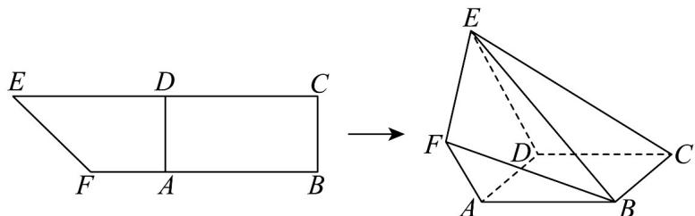

<!-- question-source:start -->
18. 如图所示，在直角梯形 $BCEF$ 中， $\angle CBF = \angle BCE = 90^{\circ}$ ， $A, D$ 分别是 $BF$ ， $CE$ 上的点，且 $AD // BC$ ， $ED = 2AF = 2$ ， $CD = t(0 < t < 3)$ ， $BC + CD = 3$ ，将四边形 $ADEF$ 沿 $AD$ 向上折起，连接 $BE, BF, CE$ ，在折起的过程中，记二面角 $E - AD - C$ 的大小为 $\alpha (0 < \alpha < \pi)$ ，记几何体 $EFABCD$ 的体积为 $V$ 。

(1)求证： $BF \parallel$ 平面 CDE；

(2) 当 $t = 2$ 时，请将 $V$ 表达为关于 $\alpha$ 的函数，并求该函数的最大值；

(3)若平面 $EFB$ 和平面 $EBC$ 垂直，当 $\alpha$ 取得最大值时，求 $V$ 的值.
<!-- question-source:end -->

![[高中/课堂同步/题库/人教A版高中数学同步讲义(2026)/03_选择性必修第一册/期中专项训练+期中模拟卷/专项训练/专题04_空间向量的应用_五大题型__高效培优期中专项训练_数学人教A/_compact/answers/Q00062228A1.md]]
