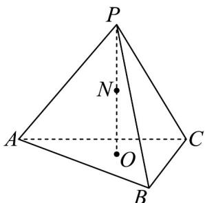

<!-- question-source:start -->
19. 如图，在棱长为 $^6$ 的正四面体 $P - ABC$ 中，点 $O$ 是顶点 $P$ 在底面 $ABC$ 内的射影， $N$ 为 $PO$ 的中点，则（）

A. $AN \perp PC$

B. 点 $C$ 到平面 $ABN$ 的距离为 $3\sqrt{2}$

C. 如果在此正四面体中放入一个小球（全部进入），则小球半径的最大值为 $\frac{\sqrt{6}}{3}$

D．动点 Q 在平面 ABC 内，且满足 $\left|PQ\right|\leq5$ ，则动点 Q 的轨迹表示图形的面积为 $\pi$
<!-- question-source:end -->

![[高中/课堂同步/题库/人教A版高中数学同步讲义(2026)/03_选择性必修第一册/期中专项训练+期中模拟卷/专项训练/专题04_空间向量的应用_五大题型__高效培优期中专项训练_数学人教A/_compact/answers/Q00062229A1.md]]
