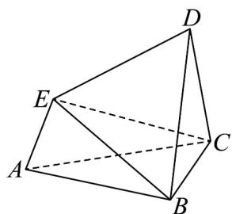

<!-- question-source:start -->
25. 如图，在多面体 $ABCDE$ 中， $VABC$ ， $\triangle BCD$ ， $\triangle CDE$ 都是边长为 2 的等边三角形，平面 $ABC \perp$ 平面 $BCD$ ，平面 $CDE \perp$ 平面 $BCD$ .

(1) 判断 $A, B, D, E$ 四点是否共面，并说明理由；

(2)在VABC中，试在边BC的中线上确定一点Q，使得 $DQ \perp$ 平面 $BCE$ ，并求 $\overline{QE} \cdot \overline{CD}$
<!-- question-source:end -->

![[高中/课堂同步/题库/人教A版高中数学同步讲义(2026)/03_选择性必修第一册/期中专项训练+期中模拟卷/专项训练/专题04_空间向量的应用_五大题型__高效培优期中专项训练_数学人教A/_compact/answers/Q00062235A1.md]]
