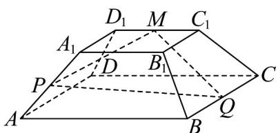

<!-- question-source:start -->
26. 如图，正四棱台 $ABCD - A_1B_1C_1D_1$ 中， $AB = 3$ ， $A_1B_1 = 1$ ， $AA_1 = 2$ ， $M$ 是 $C_1D_1$ 的中点， $Q$ 是 $BC$ 的中点，在直线 $AA_1$ 上取一点 $P$ ，使得 $MP \perp MQ$ ，则线段 $PQ$ 的长度为（）

A. 3 B. $\sqrt{15}$ C. $\frac{3\sqrt{3}}{2}$ D. 4
<!-- question-source:end -->

![[高中/课堂同步/题库/人教A版高中数学同步讲义(2026)/03_选择性必修第一册/期中专项训练+期中模拟卷/专项训练/专题04_空间向量的应用_五大题型__高效培优期中专项训练_数学人教A/_compact/answers/Q00062236A1.md]]
