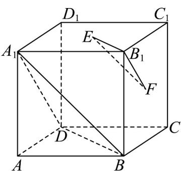

<!-- question-source:start -->
28. 如图，在正方体 $ABCD - A_{1}B_{1}C_{1}D_{1}$ 中， $E, F$ 分别为底面 $A_{1}B_{1}C_{1}D_{1}$ 和侧面 $BCC_{1}B_{1}$ 的中心。求证：

(1) $EF \parallel$ 平面 $A_{1}BD$ ;

(2)平面 $B_{1}EF / /$ 平面 $A_{1}BD$
<!-- question-source:end -->

![[高中/课堂同步/题库/人教A版高中数学同步讲义(2026)/03_选择性必修第一册/期中专项训练+期中模拟卷/专项训练/专题04_空间向量的应用_五大题型__高效培优期中专项训练_数学人教A/_compact/answers/Q00062238A1.md]]
