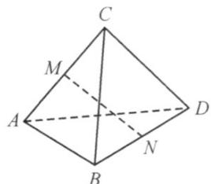

<!-- question-source:start -->
29. 如图，已知四面体 $ABCD$ ， $M$ 和 $N$ 分别是 $AC$ 和 $BD$ 的中点。

(1)若 $AB = CD$ ， $AD = BC$ ，求证： $MN\perp AC$ ， $MN\perp BD$ ；

(2)若 $MN \perp AC$ ， $MN \perp BD$ ，求证： $AB = CD$ ， $AD = BC$
<!-- question-source:end -->

![[高中/课堂同步/题库/人教A版高中数学同步讲义(2026)/03_选择性必修第一册/期中专项训练+期中模拟卷/专项训练/专题04_空间向量的应用_五大题型__高效培优期中专项训练_数学人教A/_compact/answers/Q00062239A1.md]]
