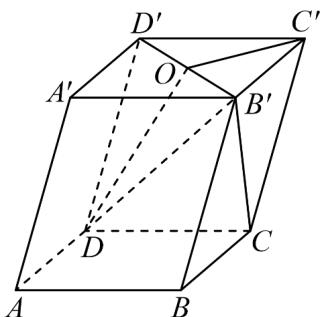

<!-- question-source:start -->
30. 如图，在平行六面体 $ABCD - A'B'C'D'$ 中， $O$ 是 $B'D'$ 的中点。

(1)用 $\overset{\text{UUU}}{AB}$ , $\overset{\text{UUU}}{AD}$ , $\overset{\text{UUU}}{AA'}$ 表示 $\overset{\text{UUU}}{DO}$ ;

(2)求证： $B^{\prime}C//$ 平面 $ODC^{\prime}$
<!-- question-source:end -->

![[高中/课堂同步/题库/人教A版高中数学同步讲义(2026)/03_选择性必修第一册/期中专项训练+期中模拟卷/专项训练/专题04_空间向量的应用_五大题型__高效培优期中专项训练_数学人教A/_compact/answers/Q00062240A1.md]]
