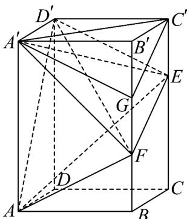

<!-- question-source:start -->
31．如图所示，在长方体 $ABCD - A'B'C'D'$ 中， $AA' = 6, AB = 4, AD = 3$ ，E，F 分别在棱 $CC'$ 和 $BB'$ 上， $C'E = \frac{1}{2} CE$ ， $FE = B'C' + BF$ ，则下列说法正确的是（）

A $V_{D^{\prime} - AEF}\neq V_{F - A^{\prime}AE}$

B. 直线 $EF$ 与 $AD$ 所成角的余弦值为 $\frac{3\sqrt{13}}{13}$ C. 直线 $AD'$ 和平面 $BB'D'D'$ 所成角的正弦值为 $\frac{2\sqrt{3}}{21}$ D. 若 $G$ 为线段 $B'F$ 的中点，则直线 $D'F''$ 平面 $A'GC'$
<!-- question-source:end -->

![[高中/课堂同步/题库/人教A版高中数学同步讲义(2026)/03_选择性必修第一册/期中专项训练+期中模拟卷/专项训练/专题04_空间向量的应用_五大题型__高效培优期中专项训练_数学人教A/_compact/answers/Q00062241A1.md]]
