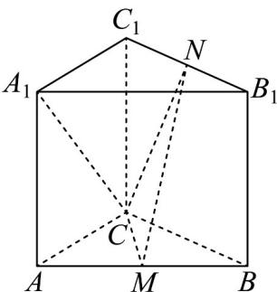

<!-- question-source:start -->
34. 如图，直三棱柱 $ABC - A_{1}B_{1}C_{1}$ 中， $M, N$ 分别为 $AB$ 和 $B_{1}C_{1}$ 的中点。

(1)求证： $MN / /$ 平面 $ACC_{1}A_{1}$

(2)若 $AC = BC = CC_{1}$ ， $\angle ACB = 90^{\circ}$ ，求二面角 $N - CM - B$ 的正切值；

(3)若 $AC = 2\sqrt{2}$ , $AB = 4$ ， $\angle ACB = 90^{\circ}$ ， $MN \perp A_{1}C$ ，求 $A_{1}C$ 与平面 $CMN$ 所成角的正弦值。
<!-- question-source:end -->

![[高中/课堂同步/题库/人教A版高中数学同步讲义(2026)/03_选择性必修第一册/期中专项训练+期中模拟卷/专项训练/专题04_空间向量的应用_五大题型__高效培优期中专项训练_数学人教A/_compact/answers/Q00062244A1.md]]
