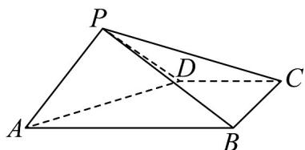

<!-- question-source:start -->
35. 如图，在四棱锥 $P - ABCD$ 中， $AB // CD, AB = 2DC, \angle ABC = 90^\circ$ ， $\triangle PAD$ 为等腰直角三角形， $AD$ 为斜边，其中 $AB = 2, PD = BC = 1, PB = PC$ 。

(1)证明：平面 $PAD \perp$ 平面ABCD；

(2)线段 $_{PB}$ 上是否存在一点 $_{T}$ ，使得 $_{AT}$ 与平面 $_{PAD}$ 所成角的正弦值为 $\frac{\sqrt{6}}{6}$ ，若存在，求出 $\frac{PT}{PB}$ 的值；若不存在，请说明理由。
<!-- question-source:end -->

![[高中/课堂同步/题库/人教A版高中数学同步讲义(2026)/03_选择性必修第一册/期中专项训练+期中模拟卷/专项训练/专题04_空间向量的应用_五大题型__高效培优期中专项训练_数学人教A/_compact/answers/Q00062245A1.md]]
