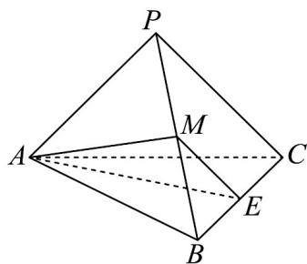

<!-- question-source:start -->
36. 如图，在三棱锥 $P - ABC$ 中，平面 $APC \perp$ 平面 $ABC$ ， $AB \perp AC$ ， $AB = AC = AP = CP = 2$ ， $E$ ， $M$ 分

别为棱 $BC$ ， $BP$ 的中点.

(1)证明： $ME \parallel$ 平面 ACP；

(2)求平面 $AME$ 与平面 $ACP$ 夹角的正弦值.
<!-- question-source:end -->

![[高中/课堂同步/题库/人教A版高中数学同步讲义(2026)/03_选择性必修第一册/期中专项训练+期中模拟卷/专项训练/专题04_空间向量的应用_五大题型__高效培优期中专项训练_数学人教A/_compact/answers/Q00062246A1.md]]
