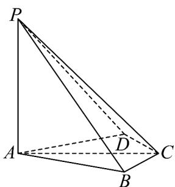

<!-- question-source:start -->
37. 如图，四棱锥 $P - ABCD$ 中， $PA \perp$ 底面 $ABCD$ ， $PA = AC = 2, BC = 1, AB = \sqrt{3}$

(1)若 $AD / /$ 平面 $PBC$ ，证明： $AD\bot PB$ ；

(2)若 $A, B, C, D$ 四点共圆，且二面角 $A - CP - D$ 的余弦值为 $\frac{\sqrt{7}}{7}$ ，求 $AD$ 。
<!-- question-source:end -->

![[高中/课堂同步/题库/人教A版高中数学同步讲义(2026)/03_选择性必修第一册/期中专项训练+期中模拟卷/专项训练/专题04_空间向量的应用_五大题型__高效培优期中专项训练_数学人教A/_compact/answers/Q00062247A1.md]]
