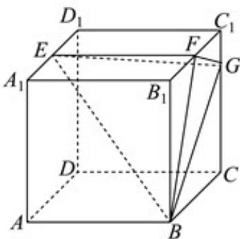

<!-- question-source:start -->
41. 已知正方体 $ABCD - A_{1}B_{1}C_{1}D_{1}$ 的棱长为 4, E, F 分别为 $A_{1}D_{1}, B_{1}C_{1}$ 的中点，G 在线段 $CC_{1}$ 上，且 $CG = 3GC_{1}$

(1)求证： $GF\perp$ 面EBF；

(2)求平面 EBF 与平面 EBG 夹角的余弦值；

(3)求点 D 到平面 EBF 的距离.
<!-- question-source:end -->

![[高中/课堂同步/题库/人教A版高中数学同步讲义(2026)/03_选择性必修第一册/期中专项训练+期中模拟卷/专项训练/专题04_空间向量的应用_五大题型__高效培优期中专项训练_数学人教A/_compact/answers/Q00062250A1.md]]
