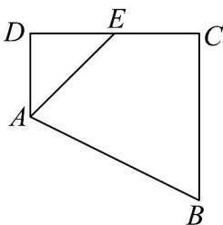
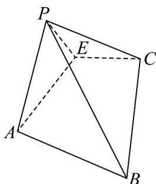

<!-- question-source:start -->
42. 如图甲，在梯形 $ABCD$ 中， $AD//BC$ ， $\angle ADC = 90^\circ$ ， $BC = CD = 2AD = 4$ ， $E$ 是 $CD$ 的中点，将 $VADE$ 沿 $AE$ 折起，使点 $D$ 到达点 $P$ 的位置，如图乙，且 $PC = 2\sqrt{3}$ .

甲

乙

(1)求证：平面 $PAE \perp$ 平面ABCE；

(2)求点 $E$ 到平面 $PBC$ 的距离；

(3)设 $AE$ 的中点为 $O$ ，在平面 $POC$ 内取点 $Q$ ，使得直线 $EQ \perp$ 平面 $PBC$ ，问点 $Q$ 是否在 $\triangle POC$ 内？
<!-- question-source:end -->

![[高中/课堂同步/题库/人教A版高中数学同步讲义(2026)/03_选择性必修第一册/期中专项训练+期中模拟卷/专项训练/专题04_空间向量的应用_五大题型__高效培优期中专项训练_数学人教A/_compact/answers/Q00062251A1.md]]
