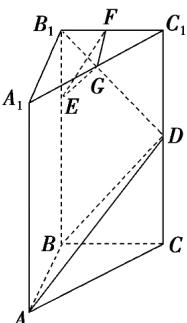

<!-- question-source:start -->
46. 如图所示，在直三棱柱 $ABC - A_{1}B_{1}C_{1}$ 中， $\angle ABC = 90^{\circ}, BC = 2, CC_{1} = 4$ ，点 $E$ 在线段 $BB_{1}$ 上，且 $EB_{1} = 1$ ， $D$ 、 $F$ 、 $G$ 分别为 $CC_{1}, C_{1}B_{1}, C_{1}A_{1}$ 的中点。

(1)求证： $B_{1}D \perp$ 平面ABD；

(2)求证：平面 $EGF / /$ 平面ABD；

(3)求平面 $EGF$ 与平面 $ABD$ 的距离.
<!-- question-source:end -->

![[高中/课堂同步/题库/人教A版高中数学同步讲义(2026)/03_选择性必修第一册/期中专项训练+期中模拟卷/专项训练/专题04_空间向量的应用_五大题型__高效培优期中专项训练_数学人教A/_compact/answers/Q00062254A1.md]]
