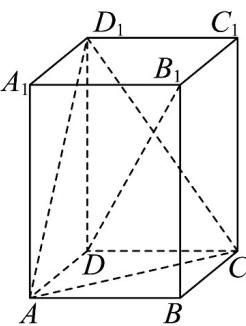

<!-- question-source:start -->
47. 如图，在正四棱柱 $ABCD - A_{1}B_{1}C_{1}D_{1}$ 中， $AB = 1$ ， $AA_{1} = 2$ ， $E$ 为线段 $A_{1}B_{1}$ 的中点，则点 $B$ 到直线 $DE$ 的距离为（）

A. $\frac{\sqrt{3}}{3}$ B. $\frac{\sqrt{5}}{5}$ C. $\frac{\sqrt{66}}{6}$ D. $\frac{\sqrt{77}}{7}$
<!-- question-source:end -->

![[高中/课堂同步/题库/人教A版高中数学同步讲义(2026)/03_选择性必修第一册/期中专项训练+期中模拟卷/专项训练/专题04_空间向量的应用_五大题型__高效培优期中专项训练_数学人教A/_compact/answers/Q00062255A1.md]]
