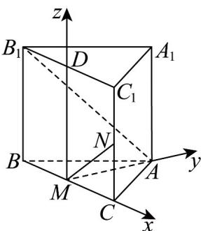

> [!faq]- 《专题04_空间向量的应用_五大题型__高效培优期中专项训练_数学人教A》官方解析
>
> > [!success]- **【答案】** ACD
>
> > [!note]- **【分析】**
> > 由正三棱柱的性质可判断 $^{A}$ ；由棱柱的体积公式可判断 $^{B}$ ；建立空间直角坐标系利用 $AB_{1}\cdot MN=0$ 可判断 $^{C}$ ；设 $MN=\lambda MA+\mu MB_{1}$ ，计算出m=-2可判断 $^{D}$ 。
>
> > [!note]- **【解析】**
> > 因为 $CC_{1} \perp$ 平面 ABC， $AM \subset$ 平面 ABC，所以 $CC_{1} \perp AM$ ，故 A 正确；
> >
> > 正三棱柱 $ABC - A_{1}B_{1}C_{1}$ 的体积 $V = AA_{1}\cdot S_{\triangle ABC} = 2\cdot \frac{1}{2}\cdot 1^{2}\cdot \sin 60^{\circ} = \frac{\sqrt{3}}{2}$ ，故B错误；
> >
> > 取 $B_{1}C_{1}$ 的中点 $D$ ，连接 $MD$ ，因为 $MC / / DC_{1}$ ， $MC = DC_{1}$ ，所以四边形 $MCC_{1}D$ 为平行四边形，
> >
> > 所以 $MD \parallel CC_{1}$ ，因为 $CC_{1} \perp$ 平面 ABC，所以 $MD \perp$ 平面 ABC，
> >
> > 又因为 $MA, MC \subset$ 平面 $ABC$ ，所以 $MD \perp MA$ ， $MD \perp MC$
> >
> > 因为 $AB = AC$ ， $M$ 为 $BC$ 中点，所以 $MA \perp BC$ ，设 $CN = m(0 \leq m \leq 2)$
> >
> > 以 $M$ 为原点，建立如图所示的空间直角坐标系，则 $M(0,0,0), A\left(0, \frac{\sqrt{3}}{2}, 0\right), B_1\left(-\frac{1}{2}, 0, 2\right), N\left(\frac{1}{2}, 0, m\right)$
> >
> > $\overrightarrow{AB_{1}}=\left(-\frac{1}{2},-\frac{\sqrt{3}}{2},2\right),\overrightarrow{MN}=\left(\frac{1}{2},0,m\right)$ ，若 $\overrightarrow{AB_{1}}\cdot\overrightarrow{MN}=0$ ，
> >
> > 即 $-\frac{1}{4} + 2m = 0 \Rightarrow m = \frac{1}{8}$ ，所以 $CN = \frac{1}{8}$ ，故C正确；
> >
> > $\overrightarrow{MA}=\left(0,\frac{\sqrt{3}}{2},0\right),\overrightarrow{MB_{1}}=\left(-\frac{1}{2},0,2\right),\overrightarrow{MN}=\left(\frac{1}{2},0,m\right)$ ，设 $\overrightarrow{MN}=\lambda\overrightarrow{MA}+\mu\overrightarrow{MB_{1}}$
> >
> > $$
> > \left(\frac {1}{2}, 0, m\right) = \lambda \left(0, \frac {\sqrt {3}}{2}, 0\right) + \mu \left(- \frac {1}{2}, 0, 2\right) \Rightarrow - \frac {1}{2} \mu = \frac {1}{2}, \frac {\sqrt {3}}{2} \lambda = 0, m = 2 \mu
> > $$
> >
> > 解得 $\lambda = 0, \mu = -1, m = -2$ ，与 $m \in [0,2]$ 矛盾，所以 $\overline{MN}, \overline{MA}, \overline{MB}_1$ 不是共面向量，
> >
> > 即 $MN$ 与 $AB_{1}$ 是异面直线，故 $\mathbf{D}$ 正确·
> >
> > 故选：ACD
> >
> > 
