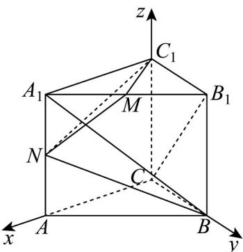

> [!faq]- 《专题04_空间向量的应用_五大题型__高效培优期中专项训练_数学人教A》官方解析
>
> > [!success]- **【答案】** (1) $\sqrt{3}$ (2) $\frac{\sqrt{30}}{10}$ (3)证明见解析
>
> > [!note]- **【分析】**
> > （1）以点 $C$ 为坐标原点，CA、CB、 $CC_{1}$ 的方向分别为 $x$ 、 $y$ 、 $z$ 轴的正方向建立空间直角坐标系，利用空间向量求 $BN$ 的长；
> >
> > (2) 利用空间向量法可求 $\stackrel{\square\square}{BA}_{1}$ 与 $\stackrel{\square\square\square}{CB}_{1}$ 夹角的余弦值；
> >
> > (3) 利用空间向量法证明出 $BN \perp C_1M$ ， $BN \perp C_1N$ ，即可证得结论成立。
>
> > [!note]- **【解析】**
> > （1）在直三棱柱 $ABC-A_{1}B_{1}C_{1}$ 中，CA=CB=1， $\angle ACB=90^{\circ}$ ， $AA_{1}=2$ ，
> >
> > 以点 $C$ 为坐标原点， $\overline{CA}$ 、 $\overline{CB}$ 、 $\overline{CC_1}$ 的方向分别为 $x$ 、 $y$ 、 $z$ 轴的正方向建立如下图所示的空间直角坐标
> >
> > 系，
> >
> > 
> >
> > 则 $B(0,1,0)$ ， $A_{1}(1,0,2)$ ， $C(0,0,0)$ ， $B_{1}(0,1,2)$ ， $C_1(0,0,2)$ ， $M\left(\frac{1}{2},\frac{1}{2},2\right)$ ， $N(1,0,1)$
> >
> > 因为 $\overline{BN} = (1, -1, 1)$ ，则 $\left|\overline{BN}\right| = \sqrt{1^{2} + (-1)^{2} + 1^{2}} = \sqrt{3}$ ，所以 BN 的长为 $\sqrt{3}$ .
> >
> > (2) 由 (1) 可得： $\overline{BA}_{1} = (1, -1, 2)$ ， $\overline{CB}_{1} = (0, 1, 2)$ ，
> >
> > 则 $\cos\overrightarrow{BA_{1}},\overrightarrow{CB_{1}}=\frac{\overrightarrow{BA_{1}}\cdot\overrightarrow{CB_{1}}}{\left|\overrightarrow{BA_{1}}\right|\cdot\left|\overrightarrow{CB_{1}}\right|}=\frac{3}{\sqrt{6}\times\sqrt{5}}=\frac{\sqrt{30}}{10}$
> >
> > 所以 $BA_{1}$ 与 $CB_{1}$ 的夹角余弦值为 $\frac{\sqrt{30}}{10}$ .
> >
> > (3) 由 (1) 可得： $BN = (1, -1, 1)$ ， $C_{1}M = \left(\frac{1}{2}, \frac{1}{2}, 0\right)$ ， $C_{1}N = (1, 0, -1)$ ，
> >
> > 则 $\overline{BN} \cdot C_{1}M = \frac{1}{2} - \frac{1}{2} = 0$ ， $BN \cdot C_{1}N = 1 - 1 = 0$ ，可知 $BN \perp C_{1}M$ ， $BN \perp C_{1}N$ ，
> >
> > 因为 $C_1M \cap C_1N = C_1$ ， $C_1M$ 、 $C_1N \subset$ 平面 $C_1MN$ ，则 $BN \perp$ 平面 $C_1MN$
> >
> > 所以 $\stackrel{\square\square}{BN}$ 是平面 $C_{1}MN$ 的一个法向量.
