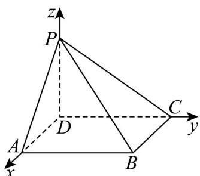

> [!faq]- 《专题04_空间向量的应用_五大题型__高效培优期中专项训练_数学人教A》官方解析
>
> > [!success]- **【答案】** (1)证明见解析 (2) $(1,0,1)$
>
> > [!note]- **【分析】**
> > （ $^{1}$ ）根据线面垂直的判定定理即可证明；
> >
> > (2) 建立空间直角坐标系，求出相关点坐标，根据法向量的求法即可得答案.
>
> > [!note]- **【解析】**
> > （1）因为底面ABCD为正方形，故 $AC \perp BD$ ；
> >
> > $PD \perp$ 平面 ABCD ， $AC \subset$ 平面 ABCD ，故 $PD \perp AC$
> >
> > $PD\cap BD = D,PD,BD\subset$ 平面PBD
> >
> > 故 $AC \perp$ 平面 PBD ;
> >
> > (2) 以 D 为坐标原点，以 DA, DC, DP 所在直线为 x, y, z 轴，建立空间直角坐标系，
> >
> > 
> >
> > 设 $AD = PD = 1$ ，则 $A(1,0,0),B(1,1,0),P(0,0,1)$
> >
> > 故 $AP = (-1,0,1),AB = (0,1,0)$
> >
> > 设平面 $APB$ 的一个法向量为 $n = (x, y, z)$ ，则 $\left\{ \begin{array}{l} \square \square \square \\ AP \cdot n = 0 \\ \square \square \square \\ AB \cdot n = 0 \end{array} \right.$ ，即 $\left\{ \begin{array}{l} -x + z = 0 \\ y = 0 \end{array} \right.$ ，令 $x = 1$ ，则 $z = 1$ ，
> >
> > 故平面 $APB$ 的一个法向量为 $n = (1,0,1)$ .
