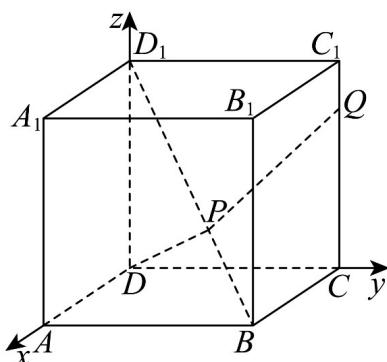

> [!faq]- 《专题04_空间向量的应用_五大题型__高效培优期中专项训练_数学人教A》官方解析
>
> > [!success]- **【答案】** ABC
>
> > [!note]- **【分析】**
> > 建立空间直角坐标系，对 $^{A}$ ，求出 $PQ$ 的坐标，再利用模长公式，即可求解；对 $^{B}$ ，利用点到直线距离的向量法，即可求解；对 $^{C}$ ，根据条件求出 $PQ$ 和平面ABCD法向量，结合条件，即可求解；对 $^{D}$ ，利用向量的垂直表示，即可求解。
>
> > [!note]- **【解析】**
> > 如图所示，以D为坐标原点，DA，DC， $DD_{1}$ 所在直线分别为x，y，z轴建立空间直角坐标系因为 $AA_{1}=6$ ，则 $B(6,6,0)$ , $D(0,0,0)$ , $C(0,6,0)$ , $C_{1}(0,6,6)$
> >
> > 所以 $BD_{1} = (-6, - 6, 6), CC_{1} = (0, 0, 6)$ ，又 $BP = \lambda BD_{1}$ ， $CQ = \mu CC_{1}$
> >
> > 则 $BP = (-6\lambda, -6\lambda, 6\lambda)$ ， $CQ = (0, 0, 6\mu)$ ，得到 $P(6 - 6\lambda, 6 - 6\lambda, 6\lambda)$ ， $Q(0, 6, 6\mu)$
> >
> > 对于选项 A，若 $\lambda=\frac{1}{3}$ ， $\mu=\frac{1}{2}$ ，则 $P(4,4,2)$ ， $Q(0,6,3)$ ， $\therefore PQ=\left(-4,2,1\right)$ ，
> >
> > $PQ=\left|\stackrel{\sqcup\sqcup\sqcup}{PQ}\right|=\sqrt{16+4+1}=\sqrt{21}$ ，所以 A 正确，
> >
> > 对于选项 B，由选项 A 知 $P(4,4,2)$ ， $Q(0,6,3)$ ，所以 $DP=(4,4,2)$ ， $DQ=(0,6,3)$
> >
> > 所以点到直线的距离 $d = \sqrt{\left|\vec{DQ}\right|^2 - \left(\frac{\left|DP\cdot DQ\right|}{\left|DP\right|}\right)^2} = \sqrt{45 - \frac{30^2}{36}} = \sqrt{45 - 25} = 2\sqrt{5}$ ，故B正确，
> >
> > 对于选项C，因为 $PQ = (6\lambda - 6, 6\lambda, 6\mu - 6\lambda)$ ，易知平面ABCD的一个法向量为 $n = (0, 0, 1)$
> >
> > 又 $PQ / /$ 平面ABCD，所以 $\overline{PQ}\cdot n = (6\lambda -6,6\lambda ,6\mu -6\lambda)\cdot (0,0,1) = 0$
> >
> > 即 $6\mu - 6\lambda = 0$ ，得到 $\lambda = \mu$ ，所以 C 正确，
> >
> > 对于选项D，∵ $PQ \perp BD_{1}$ ，∴ $\overline{PQ} \cdot \overline{BD}_{1} = -6(6\lambda - 6) - 6 \cdot 6\lambda + 6(6\mu - 6\lambda) = 0$
> >
> > 得到 $3\lambda - \mu = 1$ ，所以选项 D 错误，
> >
> > 
> >
> > 故选 **ABC**.
