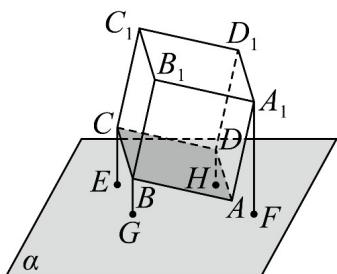

> [!faq]- 《专题04_空间向量的应用_五大题型__高效培优期中专项训练_数学人教A》官方解析
>
> > [!success]- **【答案】** A
>
> > [!note]- **【分析】**
> > 根据点到面的距离的性质，结合面面垂直的判定定理，得到 E, A, F 三点共线，根据三角关系，得到 $C_{1}$ ， $D_{1}$ ，B 到平面 $\alpha$ 的距离，进而得直线 $BD_{1}$ 与平面 $\alpha$ 的夹角正弦值，求出平面 $A_{1}C_{1}D$ 与平面 $\alpha$ 的夹角的余弦值.
>
> > [!note]- **【解析】**
> > 点 B 和点 D 到平面 $\alpha$ 的距离相等，故 BD // 平面 $\alpha$
> >
> > 而 $BD$ 为平面 $ACC_{1}A_{1}$ 法向量，故平面 $ACC_{1}A_{1} \perp$ 平面 $\alpha$ ，
> >
> > 分别过 $C$ ， $A_{1}$ 作平面 $\alpha$ 的垂线，垂足为 $E$ ， $F$ ，如图，则 $E$ ， $A$ ， $F$ 三点共线，
> >
> > 由 $BG = DH = \frac{\sqrt{2}}{2}$ ，且 $BD$ 与 $AC$ 中点重合可知 $CE = \sqrt{2}$
> >
> > 因此 $\angle CAE = 30^{\circ}$ ， $\angle A_{1}AF = 60^{\circ}$ ，故 $A_{1}F = \sqrt{3}$
> >
> > 进而由 $\angle C_{1}CE = 150^{\circ}$ 易知点 $C_1$ 到平面 $\alpha$ 的距离为 $\sqrt{2} +\sqrt{3}$
> >
> > 又因为 $B_{1}D_{1}$ 与 $A_{1}C_{1}$ 中点重合，且 $B_{1}D_{1}\parallel$ 平面 $\alpha$ ，
> >
> > 因此点 $D_{1}$ 到平面 $\alpha$ 的距离为 $\frac{\sqrt{2}}{2} +\sqrt{3}$ ，而点 $B$ 到平面 $\alpha$ 的距离为 $\frac{\sqrt{2}}{2}$
> >
> > 且 $BD_{1} = 2\sqrt{3}$ ，故直线 $BD_{1}$ 与平面 $\alpha$ 的夹角正弦值为 $\frac{\frac{\sqrt{2}}{2} + \sqrt{3} - \frac{\sqrt{2}}{2}}{2\sqrt{3}} = \frac{1}{2}$
> >
> > 易知直线 $BD_{1}$ 与平面 $A_{1}C_{1}D$ 垂直，故平面 $A_{1}C_{1}D$ 与平面 $\alpha$ 的夹角的余弦值为 $\frac{1}{2}$
> >
> > 
> >
> > 故选 **A**
