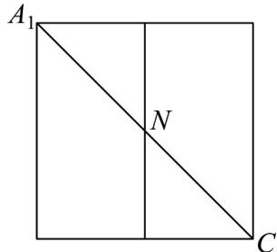
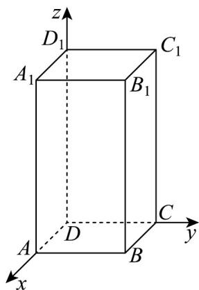

> [!faq]- 《专题04_空间向量的应用_五大题型__高效培优期中专项训练_数学人教A》官方解析
>
> > [!success]- **【答案】** ABD
>
> > [!note]- **【分析】**
> > 选项 A：把平面 $A_{1}ADD_{1}$ 与平面 $DCC_{1}D_{1}$ 展开成一个矩形，利用两点之间线段最短，通过勾股定理求展开后 $A_{1}$ 与 C 距离，得 $A_{1}N + NC$ 最小值。
> > 选项 B：先证 $AD_{1} // B_{1}C$ ，推出平面 $AB_{1}C //$ 平面 $ACD_{1}$ ，由线面平行性质可知， $BM //$ 平面 $ACD_{1}$ 时，M 轨迹是线段 $B_{1}C_{1}$ ，再用勾股定理求其长度。
> > 选项 C：建立空间直角坐标系，写出相关点坐标，得到向量 $\stackrel{\square\square\square\square}{A_{1}N}$ 与 $\stackrel{\square\square\square\square}{BD_{1}}$ ，根据向量垂直时数量积为 0 列方程求解 N 点位置，判断 N 不是 $DD_{1}$ 中点。
> > 选项 D：设 M 坐标，根据空间两点距离公式列方程，得到 M 轨迹方程，确定其轨迹是 $\frac{1}{4}$ 圆，用圆周长公式
> >
> > 求轨迹长度.
>
> > [!note]- **【解析】**
> > 将平面 $A_{1}ADD_{1}$ 与平面 $DCC_{1}D_{1}$ 展开在一个平面上，此时 $A_{1}N + NC$ 的最小值为展开后 $A_{1}$ 与 $C$ 两点间的距离．
> >
> > 
> >
> > 展开后得到一个矩形，矩形的两边长分别为 2 和 $1+1=2$
> >
> > 根据勾股定理，则 $A_{1}C = \sqrt{2^{2} + 2^{2}} = 2\sqrt{2}$ ，所以 $A_{1}N + NC$ 的最小值为 $2\sqrt{2}$ ，选项 $\mathsf{A}$ 正确。
> >
> > 因为 $BB_{1} / / DD_{1}$ ， $BB_{1} = DD_{1}$ ， $DD_{1} / / CC_{1}$ ， $DD_{1} = CC_{1}$ ，所以 $BB_{1} / / CC_{1}$ ， $BB_{1} = CC_{1}$ ，四边形 $BB_{1}C_{1}C$ 是平行四边形， $BC_{1} / / B_{1}C$ ：
> >
> > 同理可得 $AD_{1} / / BC_{1}$ ，所以 $AD_{1} / / B_{1}C$
> >
> > 易知平面 $AB_{1}C //$ 平面 $ACD_{1}$ ，若 $BM //$ 平面 $ACD_{1}$ ，则点 $M$ 的轨迹是线段 $A_{1}C_{1}$
> >
> > 在正方形 $A_{1}B_{1}C_{1}D_{1}$ 中，边长为1，根据勾股定理可得 $A_{1}C_{1} = \sqrt{1^{2} + 1^{2}} = \sqrt{2}$ ，即点 $M$ 的轨迹长度为 $\sqrt{2}$ ，选项B正确。
> >
> > 以 $D$ 为原点，分别以 $DA, DC, DD_{1}$ 所在直线为 $x, y, z$ 轴，建立空间直角坐标系。
> >
> > 
> >
> > 则 $D(0,0,0)$ ， $A_{1}(1,0,2)$ ， $B(1,1,0)$ ， $D_{1}(0,0,2)$ ，设 $N(0,0,z)$ ， $0\leq z\leq 2$
> >
> > $$
> > A _ {1} N = (- 1, 0, z - 2) \quad B D _ {1} = (- 1, - 1, 2)
> > $$
> >
> > 因为 $A_{1}N \perp BD_{1}$ ，所以 $A_{1}N \cdot BD_{1} = (-1) \times (-1) + 0 \times (-1) + (z - 2) \times 2 = 0$ ，即 $1 + 2(z - 2) = 0$ ， $1 + 2z - 4 = 0$
> >
> > $2z = 3$ ，解得 $z = \frac{3}{2}$ ，所以 $N$ 不是 $DD_{1}$ 的中点，选项C错误.
> >
> > 设 $M(x,y,2)$ ， $0\leq x\leq 1$ ， $0\leq y\leq 1$ ，已知 $A(1,0,0)$ ，由 $AM = \sqrt{5}$ ，根据空间两点间距离公式可得：
> >
> > $\sqrt{(x - 1)^2 + y^2 + 2^2} = \sqrt{5}$ 即 $(x - 1)^2 + y^2 = 1$ （ $0 \leq x \leq 1$ ， $0 \leq y \leq 1$ ）.
> >
> > 所以点 M 的轨迹是以 $(1,0)$ 为圆心，1 为半径的 $\frac{1}{4}$ 圆。
> >
> > 根据圆的周长公式，则点 $M$ 的轨迹长度为 $\frac{1}{4} \times 2\pi \times 1 = \frac{\pi}{2}$ ，选项D正确。
> >
> > 故选 **ABD**
