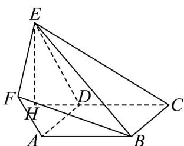
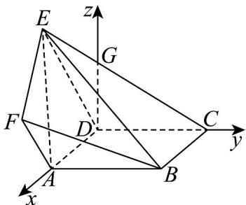

> [!faq]- 《专题04_空间向量的应用_五大题型__高效培优期中专项训练_数学人教A》官方解析
>
> > [!success]- **【答案】** (1)证明见解析 (2) $V=\frac{5}{3}\sin\alpha;\frac{5}{3}$ (3) $\frac{15\sqrt{2}-10}{18}$
>
> > [!note]- **【分析】**
> > （1）由面面平行的判定定理可得平面 $ABF / /$ 平面 $CDE$ ，即可证明；
> >
> > (2) 根据题意，由条件可得 $V = V_{E-ABCD} + V_{E-ABF}$ ，然后分别表示出 $V_{E-ABCD}$ 与 $V_{E-ABF}$ ，然后代入计算，即可得到结果；
> >
> > (3) 根据题意，建立空间直角坐标系，分别求得平面 $EFB$ ，平面 $EBC$ 的法向量，由 $n \cdot m = 0$ 可得 $\alpha$ 的最大值，然后代入 (2) 中的体积公式计算，即可得到结果。
>
> > [!note]- **【解析】**
> > （1）在梯形 $BCEF$ 中，因为 $BF // CE$ ，所以翻折后有 $AB // DC$ ，且 $AF // ED$
> >
> > 因为 $AB \notin$ 平面 $CDE$ ， $DC \subset$ 平面 $CDE$ ，故 $AB //$ 平面 $CDE$ ，同理可得 $AF //$ 平面 $CDE$
> >
> > 因为 $AB \cap AF = A$ ， $AB, AF \subset$ 平面 ABF，
> >
> > 所以平面 $ABF //$ 平面 $CDE$ ，又因为 $BF \subset$ 平面 $ABF$ ，所以 $BF //$ 平面 $CDE$ .
> >
> > (2)
> >
> > 
> >
> > 由题意，在梯形 $BCEF$ 中， $\angle CBF = \angle BCE = 90^{\circ}$ ， $AD / / BC$ ，即 $AD\bot CE$
> >
> > 且 $AD \perp FB$ ，所以翻折后有 $AD \perp ED$ ， $AD \perp DC$ ，且 $ED \cap DC = D$
> >
> > 所以 $AD \perp$ 平面 CDE ，同理， $AD \perp$ 平面 ABF ，
> >
> > 由二面角 $E - AD - C$ 的大小为 $\alpha$ ，得 $\angle EDC = \angle FAB = \alpha$
> >
> > 过点 $E$ 作 $CD$ 的垂线，交直线 $CD$ 于 $H$ ，由 $AD \perp$ 平面 $CDE$ ， $HE \subset$ 平面 $CDE$
> >
> > 所以 $AD \perp EH$ ，且 $AD \cap DC = D$ ，所以 $EH \perp$ 平面 $ABCD$
> >
> > 即 $EH$ 是四棱锥 $E - ABCD$ 的高，
> >
> > 由 $ED = 2, CD = t = 2, BC = 3 - CD = 3 - t = 1$
> >
> > 所以 $V_{E-ABCD}=\frac{1}{3}S_{ABCD}\cdot\left|EH\right|=\frac{1}{3}\times2\times1\times2\sin\alpha=\frac{4}{3}\sin\alpha$
> >
> > 由 $ED // AF$ ， $ED \notin$ 平面 $ABF$ ， $AF \subset$ 平面 $ABF$ ，所以 $ED //$ 平面 $ABF$ ，
> >
> > 又因为 $AD \perp$ 平面 ABF ，且 AF = 1 ，
> >
> > 所以 $V_{E-ABF} = V_{D-ABF} = \frac{1}{3} S_{\triangle ABF} \cdot |DA| = \frac{1}{3} \times \frac{1}{2} \times 2 \times 1 \times \sin \alpha \times 1 = \frac{1}{3} \sin \alpha$
> >
> > 所以 $V = V_{E-ABCD} + V_{E-ABF} = \frac{5}{3} \sin \alpha$ ， $\alpha \in (0, \pi)$ ，
> >
> > 当 $\alpha=\frac{\pi}{2}$ 时，V 取得最大值 $\frac{5}{3}$ .
> >
> > (3)
> >
> > 
> >
> > 过点 $D$ 作 $DC$ 的垂线，交直线 $CE$ 于点 $G$ ，分别以 $\overline{DA},\overline{DC},\overline{DG}$ 为 $x,y,z$ 轴
> >
> > 正方向建立空间直角坐标系，则 $D(0,0,0), A(3 - t,0,0), C(0,t,0), B(3 - t,t,0), E(0,2\cos \alpha, 2\sin \alpha)$
> >
> > $$
> > F (3 - t, \cos \alpha , \sin \alpha)
> > $$
> >
> > 在平面 EFB 中， $BF = (0, \cos \alpha - t, \sin \alpha)$ ， $EF = (3 - t, -\cos \alpha, -\sin \alpha)$ ，
> >
> > 设平面 EFB 的一个法向量为 $n = (x, y, z)$
> >
> > $$
> > \left\{\begin{array}{l}n \cdot B E = y (\cos \alpha - t) + z \sin \alpha = 0\\\rightarrow \square \square\\n \cdot E F = (3 - t) x - y \cos \alpha - z \sin \alpha = 0\end{array}, \right.
> > $$
> >
> > 令 $y = \sin \alpha$ ，则 $z = t - \cos \alpha, x = \frac{t}{3 - t} \sin \alpha$
> >
> > 所以 $\vec{n} = \left(\frac{t}{3 - t}\sin \alpha ,\sin \alpha ,t - \cos \alpha\right)$
> >
> > 在平面 $EBC$ 中， $CB = (3 - t, 0, 0), CE = (0, 2\cos \alpha - t, 2\sin \alpha)$
> >
> > 设平面 EBC 的一个法向量为 $m = \left(x_{1}, y_{1}, z_{1}\right)$ ,
> >
> > 则 $\left\{ \begin{array}{l}m\cdot CB = (3 - t)x_{1} = 0\\ m\cdot CE = y_{1}(2\cos \alpha -t) + z_{1}\cdot 2\sin \alpha = 0 \end{array} \right.$
> >
> > 令 $y_{1} = 2\sin \alpha$ ，则 $z_{1} = t - 2\cos \alpha ,x_{1} = 0$ ，所以 $m = (0,2\sin \alpha ,t - 2\cos \alpha)$
> >
> > 因为平面 EFB 和平面 EBC 垂直，所以 $n \cdot m = 0$ ，
> >
> > 即 $2\sin^2\alpha + (t - \cos \alpha)(t - 2\cos \alpha) = 0$ ，整理可得 $\cos \alpha = \frac{1}{3}\left(t + \frac{2}{t}\right)$
> >
> > 因为 $\alpha \in (0, \pi)$ ， $0 < t < 3$ ，所以 $\cos \alpha = \frac{2}{3} \sqrt{t \cdot \frac{2}{t}} = \frac{2}{3} \sqrt{2}$
> >
> > 当且仅当 $t = \sqrt{2}$ 时，等号成立，
> >
> > 故当 $\alpha$ 取得最大值时，即 $\cos \alpha$ 取得最小值 $\frac{2}{3}\sqrt{2}$
> >
> > 此时 $V = V_{E - ABCD} + V_{E - ABF} = \frac{2}{3} t(3 - t)\sin \alpha +\frac{1}{6} t(3 - t)\sin \alpha = \frac{5}{6} t(3 - t)\sin \alpha$
> >
> > 由 $t = \sqrt{2}$ ， $\cos \alpha = \frac{2}{3}\sqrt{2}$ ， $\alpha \in (0,\pi)$ ，所以 $\sin \alpha = \frac{1}{3}$ ，则 $V = \frac{15\sqrt{2} - 10}{18}$
