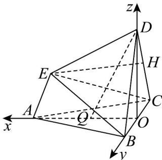

> [!faq]- 《专题04_空间向量的应用_五大题型__高效培优期中专项训练_数学人教A》官方解析
>
> > [!success]- **【答案】** (1)共面，理由见解析 (2) $Q$ 为 $OA$ 中点，1
>
> > [!note]- **【分析】**
> > （1）取 $BC$ 的中点 $O$ ，取 $CD$ 的中点 $H$ ，以 $O$ 为原点建系，求证 $\overline{BE} = \overline{BA} + \frac{1}{2} \overline{BD}$ 即可；
> >
> > (2) 设 $\overline{OU} = \lambda \overline{OA} = (\sqrt{3}\lambda, 0, 0)$ ，根据 $\overline{DQ} \cdot \overline{BE} = 0$ ， $\overline{DQ} \cdot \overline{OB} = 0$ 求出点 Q 坐标即可计算.
>
> > [!note]- **【解析】**
> > $(1)A,B,D,E$ 四点共面．理由如下：
> >
> > 如图，取 BC 的中点 O，连接 AO，DO，取 CD 的中点 H，连接 EH，
> >
> > 在多面体 ABCDE 中，VABC， $\triangle BCD$ ， $\triangle CDE$ 都是边长为 2 的等边三角形，
> >
> > 则在等边三角形 DCE 中， $EH \perp CD$ ，
> >
> > 又因为平面 $DCE \perp$ 平面 BCD ，平面 $DCE \cap$ 平面 BCD = CD ，EH ⊂ 平面 DCE ，
> >
> > 所以 $EH \perp$ 平面 BCD ，
> >
> > 同理，得 $AO \perp$ 平面 BCD ， $DO \perp$ 平面 ABC ，
> >
> > 所以 OA，OB，OD 两两垂直，且 EH //OA，
> >
> > 以 O 为坐标原点，OA，OB，OD 所在直线分别为 x 轴，y 轴，z 轴建立空间直角坐标系 Oxyz.
> >
> > 则 $C(0,-1,0)$ ， $B(0,1,0)$ ， $D(0,0,\sqrt{3})$ ， $A(\sqrt{3},0,0)$ ， $H\left(0,-\frac{1}{2},\frac{\sqrt{3}}{2}\right)$ ，
> >
> > 设 $E(a,b,c)$ ，由 $HE=OA$ ，即 $\left(a,b+\frac{1}{2},c-\frac{\sqrt{3}}{2}\right)=\left(\sqrt{3},0,0\right)$ ，
> >
> > 解得 $a=\sqrt{3}$ ， $b=-\frac{1}{2}$ ， $c=\frac{\sqrt{3}}{2}$ ，所以 $E\left(\sqrt{3},-\frac{1}{2},\frac{\sqrt{3}}{2}\right)$ ，所以 $\overrightarrow{BE}=\left(\sqrt{3},-\frac{3}{2},\frac{\sqrt{3}}{2}\right)$ 。
> >
> > 又 $\overrightarrow{BA}=\left(\sqrt{3},-1,0\right)$ ， $\overrightarrow{BD}=\left(0,-1,\sqrt{3}\right)$ ，所以 $\overrightarrow{BE}=\overrightarrow{BA}+\frac{1}{2}\overrightarrow{BD}$ ，则 $\overrightarrow{BE},\overrightarrow{BA},\overrightarrow{BD}$ 共面，
> >
> > 因为 B 为公共点，所以 A，B，D，E 四点共面。
> >
> > 
> >
> > (2) 如图，设 $\overline{OQ} = \lambda \overline{OA} = (\sqrt{3}\lambda, 0, 0)$ ，故 $\overline{DQ} = \overline{OQ} - \overline{OD} = (\sqrt{3}\lambda, 0, -\sqrt{3})$
> >
> > 若 $DQ \perp$ 平面 BCE ，则 $\overline{DQ} \cdot \overline{BE} = 0$ ， $\overline{DQ} \cdot \overline{OB} = 0$ ，即 $3\lambda - \frac{3}{2} = 0$ ，解得 $\lambda = \frac{1}{2}$
> >
> > 所以 $Q$ 为 $OA$ 中点时， $DQ \perp$ 平面 $BCE$
> >
> > 当 $\lambda = \frac{1}{2}$ 时， $Q\left(\frac{\sqrt{3}}{2},0,0\right)$ ，又 $E\left(\sqrt{3}, - \frac{1}{2},\frac{\sqrt{3}}{2}\right)$ ， $C(0, - 1,0)$ ， $D(0,0,\sqrt{3})$
> >
> > 所以 $\overrightarrow{QE}=\left(\frac{\sqrt{3}}{2},-\frac{1}{2},\frac{\sqrt{3}}{2}\right)$ ， $\overrightarrow{CD}=\left(0,1,\sqrt{3}\right)$ ，则 $\overrightarrow{QE}\cdot\overrightarrow{CD}=-\frac{1}{2}+\frac{3}{2}=1$
