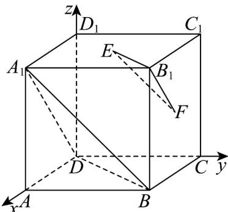

> [!faq]- 《专题04_空间向量的应用_五大题型__高效培优期中专项训练_数学人教A》官方解析
>
> > [!success]- **【答案】** (1)证明见解析 (2)证明见解析
>
> > [!note]- **【分析】**
> > （1）证法 $^{1}$ ：建立空间直角坐标系，表示出各点坐标，可得 $A_{1}B=2EF$ ，由线面平行的判定定理证明即可；
> >
> > 证法 $^{2}$ ：求出平面 $A_{1}BD$ 的法向量 n ，判断 $EF \cdot n = 0$ 即可证明
> >
> > (2) 求出平面 $B_{1}EF$ 的一个法向量 $m$ ，判断 $m$ 与 $n$ 关系即可证明；
>
> > [!note]- **【解析】**
> > （1）以D为原点，DA，DC， $DD_{1}$ 分别为x轴、y轴、z轴，建立空间直角坐标系，
> >
> > 
> >
> > 令正方体的棱长为 $^{2}$ ，则 $D(0,0,0)$ ， $A_{1}(2,0,2)$ ， $B(2,2,0)$ ， $B_{1}(2,2,2)$ ， $E(1,1,2)$ ， $F(1,2,1)$
> >
> > 证法 1： $EF = (0,1,-1)$ ， $A_{1}B = (0,2,-2)$ ，因为 $A_{1}B = 2EF$ ，所以 $A_{1}B // EF$ ，又 $A_{1}B \subset$ 平面 $A_{1}BD$ ， $EF \not\subset$ 平面 $A_{1}BD$ ，所以 $EF //$ 平面 $A_{1}BD$ 。
> >
> > 证法 $^{2}$ ：设平面 $A_{1}BD$ 的一个法向量 $n=(x,y,z)$ ， $\overline{DA}_{1}=(2,0,2)$ ， $\overline{DB}=(2,2,0)$ ，根据 $\left\{\begin{aligned}&\overline{DA}_{1}\cdot n=0\\&\overline{DB}\cdot n=0\end{aligned}\right.$ ，可得 $\left\{\begin{aligned}&2x+2z=0\\&2x+2y=0\end{aligned}\right.$ ，令 $x=-1$ ，则 y=1，z=1，即 $n=(-1,1,1)$ ，
> >
> > 因为 $EF \cdot n = 0$ ， $EF \not\subset$ 平面 $A_{1}BD$ ，所以 $EF //$ 平面 $A_{1}BD$ 。
> >
> > (2) 设平面 $B_{1}EF$ 的一个法向量 $m = (x_{0}, y_{0}, z_{0})$ ， $\overrightarrow{B_{1}F} = (-1, 0, -1)$ ， $\overrightarrow{EF} = (0, 1, -1)$ ，根据 $\left\{ \begin{array}{l} EF \cdot m = 0 \\ \overrightarrow{B_{1}F} \cdot m = 0 \end{array} \right.$ ，可得
> >
> > $\left\{ \begin{array}{l} y - z = 0 \\ -x - z = 0 \end{array} \right.$ ，取 $y = 1$ ，则 $m = (-1,1,1)$ ，所以 $\square m = n$ ，则 $\square m / / n$ ，所以平面 $B_{1}EF / /$ 平面 $A_{1}BD$ ：
