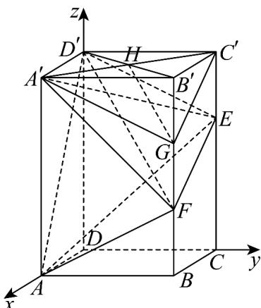

> [!faq]- 《专题04_空间向量的应用_五大题型__高效培优期中专项训练_数学人教A》官方解析
>
> > [!success]- **【答案】** ABD
>
> > [!note]- **【分析】**
> > 对于 $^{A}$ ，建立空间直角坐标系，利用向量法判断直线 $A^{\prime}D^{\prime}$ 不平行于平面 AEF，结合等体积即可判断；对于 BC，利用直线方向向量和平面法向量，根据线线角、线面角的向量公式直接计算即可；对于 D，连接 $B^{\prime}D^{\prime}$ ，交 $A^{\prime}C^{\prime}$ 于点 H，通过 $D^{\prime}F // HG$ 即可判断。
>
> > [!note]- **【解析】**
> > 对于 $^{A}$ ，因为 $FE = FB + BC + CE$ ，又 $FE = B'C' + BF$ ，所以 $FB + BC + CE = B'C' + BF$ ， $BC = B'C'$ ，所以 $CE = 2BF$ ，
> >
> > 又 $C'E = \frac{1}{2}CE$ ， $CE = \frac{2}{3}CC'$ ， $BB' = CC'$ ，所以 $BF = \frac{1}{3}BB'$
> >
> > 综上可知， $E,F$ 分别为所在棱的三等分点，
> >
> > 以 D 为原点， $DA, DC, DD'$ 所在直线分别为 x, y, z 轴，建立如图所示的空间直角坐标系，则 $E(0,4,4), F(3,4,2), A(3,0,0), D(0,0,0)$ ， $D'(0,0,6), C(0,4,0), B(3,4,0)$ ，
> >
> > 所以 $EF = (3,0,-2)$ , $AF = (0,4,2)$ , $D'A' = DA = (3,0,0)$ ,
> >
> > 设平面 AEF 的法向量为 $n = (a, b, c)$
> >
> > 则 $\left\{ \begin{array}{l} \overrightarrow{EE} \cdot n = 3a - 2c = 0 \\ \overrightarrow{AF} \cdot n = 4b + 2c = 0 \end{array} \right.$ ，取 $n = \left(2, -\frac{3}{2}, 3\right)$ ，则
> >
> > 所以 $D^{\prime}A^{\prime}\cdot n=6$ ，所以直线 $A^{\prime}D^{\prime}$ 不平行于平面 AEF，
> >
> > 所以 $A', D'$ 两点到平面 AEF 的距离不相等，所以 $V_{D'-AEF} \neq V_{A'-AEF} = V_{F-A'AE}$ ，故 A 正确；对于 B， $EF = (3, 0, -2)$ ， $DA = (3, 0, 0)$ ，
> >
> > 
> >
> > 则直线 与 $EF$ 和 $AD$ 所成角的余弦值为 $\left|\cos EF, DA\right| = \frac{\left|\overrightarrow{EF} \cdot \overrightarrow{DA}\right|}{\left|EF\right|\left|\overrightarrow{DA}\right|} = \frac{9}{3\sqrt{13}} = \frac{3\sqrt{13}}{13}$ ，故 B 正确；
> >
> > 对于 C， $AD' = (-3, 0, 6)$ ， $DD' = (0, 0, 6)$ ， $DB = (3, 4, 0)$
> >
> > 设平面 $BB^{'}D^{'}D$ 的一个法向量为 $m=(x,y,z)$ ，则 $\left\{\begin{aligned}DD^{\prime}\cdot m=6z=0\\ DB\cdot m=3x+4y=0\end{aligned}\right.$
> >
> > 取 x = -4 ，得平面 $BB'D'D$ 的一个法向量为 $m = (-4, 3, 0)$
> >
> > 设直线 $AD'$ 与平面 $BB'D'D$ 所成的角为 $\theta$ ，
> >
> > $$
> > \sin \theta = \left| \cos A D ^ {\prime}, m \right| = \frac {\left| A D ^ {\prime} \cdot m \right|}{\left| A D ^ {\prime} \right| | m |} = \frac {1 2}{\sqrt {4 5} \times \sqrt {2 5}} = \frac {4 \sqrt {5}}{2 5}
> > $$
> >
> > 所以直线 $AD'$ 和平面 $BB'D'D$ 所成角的正弦值为 $\frac{4\sqrt{5}}{25}$ ，故C错误；
> >
> > 对于 D，连接 $B^{\prime}D^{\prime}$ ，交 $A^{\prime}C^{\prime}$ 于点 H，连接 HG，
> >
> > 因为 $A'B'C'D'$ 为矩形，所以 $H$ 是 $B'D'$ 的中点，
> >
> > 有 G 为 $B'F$ 的中点，所以 $D'F // HG$
> >
> > 又 $D^{\prime}F\not\subset$ 平面 $A^{\prime}GC^{\prime}$ ， $HG\subset$ 平面 $A^{\prime}GC^{\prime}$ ，从而 $D^{\prime}F//$ 平面 $A^{\prime}GC^{\prime}$ ，故 $\mathbb{D}$ 正确·
> >
> > 故选 **ABD**
