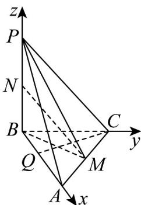

> [!faq]- 《专题04_空间向量的应用_五大题型__高效培优期中专项训练_数学人教A》官方解析
>
> > [!success]- **【答案】** $\frac{1}{4}/0.25$
>
> > [!note]- **【分析】**
> > 建立空间直角坐标系，设 $\frac{\left|\begin{matrix}BQ\\BA\end{matrix}\right|}{\left|\begin{matrix}BA\end{matrix}\right|}=\lambda$ ，利用异面直线夹角的向量公式即可求解.
>
> > [!note]- **【解析】**
> > 如图，在三棱锥 P-ABC 中，AB=BC=2， $AC=2\sqrt{2}$ ，∴ $BA\perp BC$ ，
> >
> > ∵ $PB \perp$ 平面 ABC ，以 B 为原点，BA, BC, BP 所在直线为坐标轴建立空间直角坐标系，
> >
> > 
> >
> > 可知 $B(0,0,0)$ ， $C(0,2,0)$ ， $M(1,1,0)$
> >
> > $\because BM = \sqrt{2}, MN = \sqrt{6}, \backslash BN = \sqrt{MN^2 - BM^2} = 2,$
> >
> > ∴ PB = 4，则 $P(0,0,4)$ ，设 $\frac{\left|\begin{matrix} B & Q \\ \vdots & \vdots \\ A & B \end{matrix}\right|}{\left|\begin{matrix} B & A \\ A & B \end{matrix}\right|} = \lambda$ ，且 $0 < \lambda < 1$ ，则 $Q(2\lambda,0,0)$ ，
> >
> > 可知 $\overline{PM} = (1,1,-4), \overline{CQ} = (2\lambda,-2,0)$ ，∴ $PM \cdot CQ = 1 \times 2\lambda + 1 \times (-2) + (-4) \times 0 = 2\lambda - 2$
> >
> > $\left|\overline{PM}\right| = \sqrt{1^2 + 1^2 + (-4)^2} = 3\sqrt{2}$ ， $\left|\overline{CQ}\right| = \sqrt{4\lambda^2 + 4}$ ，异面直线 $PM$ 与 $CQ$ 所成的角的余弦值为 $\frac{\sqrt{34}}{34}$
> >
> > $\therefore \frac{\left|\overrightarrow{PM} \cdot \overrightarrow{CQ}\right|}{\left|PM\right| \cdot \left|CQ\right|} = \frac{\left|2\lambda - 2\right|}{3\sqrt{2} \cdot \sqrt{4\lambda^2 + 4}} = \frac{\sqrt{34}}{34}$ ，解得 $\lambda = \frac{1}{4}$ 或 $\lambda = 4$ （舍去）， $\therefore \frac{\left|\overrightarrow{BQ}\right|}{\left|BA\right|} = \frac{1}{4}$ .
> >
> > 故答案为： $\frac{1}{4}$
