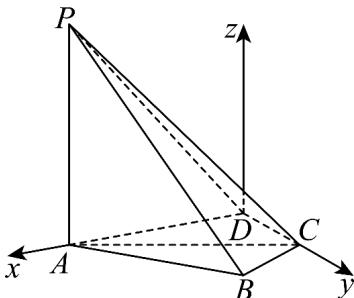

> [!faq]- 《专题04_空间向量的应用_五大题型__高效培优期中专项训练_数学人教A》官方解析
>
> > [!success]- **【答案】** $^{(1)}$ 证明见解析 (2) $\sqrt{3}$
>
> > [!note]- **【分析】**
> > （1）根据题意，证得 $AB \perp BC$ 和 $PA \perp BC$ ，利用线面垂直的判定定理，证得 $BC \perp$ 平面 $PAB$ ，再由线面平行的性质定理，证得 $AD // BC$ ，得到 $AD \perp$ 平面 $PAB$ ，进而证得 $AD \perp PB$ ·
> >
> > (2) 以 $D$ 为原点，过点 $D$ 平行 $AP$ 的直线为 $z$ 轴，建立坐标系，设 $A(a,0,0), a > 0$ ，分别求得平面 $CPD$ 和平面 $ACP$ 的法向量 $n = (2,0,-a)$ 和 $\stackrel{\sqcup}{m} = (\sqrt{4 - a^2}, a,0)$ ，结合向量的夹角公式，列出方程，求得 $a$ 的值，即可求解.
>
> > [!note]- **【解析】**
> > （1）证明：在VABC中，因为 $AC = 2, BC = 1, AB = \sqrt{3}$
> >
> > 可得 $AB^{2} + BC^{2} = AC^{2}$ ，所以 $AB \perp BC$ ，
> >
> > 又因为 $PA \perp$ 底面 ABCD ，且 $BC \subset$ 底面 ABCD ，所以 $PA \perp BC$
> >
> > 因为 $AB \cap PA = A$ ，且 $AB, PA \subset$ 平面 PAB，所以 $BC \perp$ 平面 PAB，
> >
> > 又因为 $AD / /$ 平面 $PBC$ ， $AD \subset$ 平面 $ABCD$ ，且平面 $ABCD \cap$ 平面 $PBC = BC$
> >
> > 所以 $AD \parallel BC$ ，所以 $AD \perp$ 平面 PAB，
> >
> > 因为 $PB \subset$ 平面 $PAB$ ，所以 $AD \perp PB$ .
> >
> > (2) 解：由 (1) 知 $AB \perp BC$ ，因为 $A, B, C, D$ 四点共圆，可得 $AD \perp DC$ ，
> >
> > 以 $D$ 为原点，以 $DA, DC$ 所在直线分别为 $x$ 轴和 $y$ 轴，过点 $D$ 平行于 $AP$ 的直线为 $z$ 轴，
> >
> > 建立空间直角坐标系，如图所示，则 $D(0,0,0)$
> >
> > 设 $A(a,0,0),a > 0$ ，则 $CD = \sqrt{4 - a^2}$ ，即 $C(0,\sqrt{4 - a^2},0),P(a,0,2)$
> >
> > 可得 $\overline{CD}=(0,-\sqrt{4-a^{2}},0),\overline{AC}=(-a,\sqrt{4-a^{2}},0),\overline{CP}=(a,-\sqrt{4-a^{2}},2)$
> >
> > 设平面 CPD 的法向量为 $n=(x,y,z)$ ，则 $\left\{\begin{aligned}\overrightarrow{CD}\cdot n&=-\sqrt{4-a^{2}}y=0\\\overrightarrow{CP}\cdot n&=ax-\sqrt{4-a^{2}}y+2z=0\end{aligned}\right.$
> >
> > 取 $x = 2$ ，可得 $y = 0, z = -a$ ，所以 $n = (2, 0, -a)$
> >
> > 设平面 $\underset{ACP}{的法向量为}$ $m=(x_{1},y_{1},z_{1})$ ，则 $\left\{\begin{aligned}&\stackrel{\leftrightarrow}{A}\stackrel{\leftrightarrow}{C}\cdot n=-ax_{1}+\sqrt{4-a^{2}}y_{1}=0\\&\stackrel{\leftrightarrow}{C}P\cdot n=ax_{1}-\sqrt{4-a^{2}}y_{1}+2z_{1}=0\end{aligned}\right.$
> >
> > 取 $y = a$ ，可得 $x = \sqrt{4 - a^2}, z = 0$ ，所以 $\stackrel{\sqcup}{m} = (\sqrt{4 - a^2}, a, 0)$
> >
> > 因为二面角 A - CP - D 的余弦值为 $\frac{\sqrt{7}}{7}$ ，
> >
> > 可得 $\left|\cos m,n\right|=\frac{\left|m:n\right|}{\left|m\right|\left|n\right|}=\frac{2\sqrt{4-a^{2}}}{\sqrt{4-a^{2}+a^{2}}\sqrt{4+a^{2}}}=\frac{\sqrt{7}}{7}$ ，解得 $a^{2}=3$ ，
> >
> > 因为 $a > 0$ ，所以 $a = \sqrt{3}$ ，即 $AD$ 的长为 $\sqrt{3}$
> >
> > 
