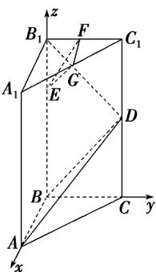

> [!faq]- 《专题04_空间向量的应用_五大题型__高效培优期中专项训练_数学人教A》官方解析
>
> > [!success]- **【答案】** (1)证明见解析； (2)证明见解析； (3) $\frac{3\sqrt{2}}{2}$ .
>
> > [!note]- **【分析】**
> > （1）建立合适空间直角坐标系，应用向量法可得 $B_{1}D \perp BA$ ， $B_{1}D \perp BD$ ，再由线面垂直的判定定理即可证得结论；
> >
> > (2) 同 (1) 可证 $B_{1}D \perp$ 平面 EFG，结合 (1) 结论及线面垂直的性质即可证；
> >
> > (3) 向量法求点 F 到平面 ABD 的距离，结合 (2) 结论即可得结果.
>
> > [!note]- **【解析】**
> > （1）由题设， $BA, BC, BB_{1}$ 两两互相垂直，
> >
> > 以 B 为坐标原点，BA, BC, $BB_{1}$ 分别为 x 轴、y 轴、z 轴建立空间直角坐标系，如图所示，
> >
> > 
> >
> > 则 $B(0,0,0)$ , $D(0,2,2)$ , $B_{1}(0,0,4)$ ，设 BA = a，则 $A(a,0,0)$ .
> >
> > 所以 $\overline{BA} = (a,0,0),\overline{BD} = (0,2,2),\overline{B_1D} = (0,2, - 2)$ ，易得 $\overline{B_1D}\cdot \overline{BA} = 0$ ， $\overline{B_1D}\cdot \overline{BD} = 0$
> >
> > 所以 $B_{1}D \perp BA$ ， $B_{1}D \perp BD$ ，所以 $B_{1}D \perp BA$ ， $B_{1}D \perp BD$
> >
> > 又 $BA \cap BD = B$ ，且 $BA, BD$ 都在平面 $ABD$ 内，故 $B_{1}D \perp$ 平面 $ABD$ .
> >
> > (2) 由题意知 $E(0,0,3), G(\frac{a}{2},1,4), F(0,1,4)$ ，则 $\overline{EG} = (\frac{a}{2},1,1), \overline{EF} = (0,1,1)$
> >
> > 所以 $B_{1}D \cdot EG = 0$ ， $B_{1}D \cdot EF = 0$ ，则 $B_{1}D \perp EG$ ， $B_{1}D \perp EF$
> >
> > 所以 $B_{1}D \perp EG$ ， $B_{1}D \perp EF$
> >
> > 又 $EG \cap EF = E$ 且 $B_{1}D, EF$ 都在平面 EFG 内，所以 $B_{1}D \perp$ 平面 EFG，
> >
> > 结合（1）知，平面 $EGF//$ 平面ABD·
> >
> > (3) 由 (1) (2) 知， $\overline{BF} = (0,1,4)$ ， $\overline{B_{1}D} = (0,2,-2)$ 是平面 ABD 的法向量，
> >
> > 所以点 $F$ 到平面 $ABD$ 的距离为 $d = \frac{\left|\overrightarrow{BF} \cdot \overrightarrow{B_1 D}\right|}{\left|\overrightarrow{B_1 D}\right|} = \frac{6}{\sqrt{8}} = \frac{3\sqrt{2}}{2}$
> >
> > 由（2）知，平面EGF与平面ABD的距离等于点 $F$ 到平面ABD的距离，
> >
> > 所以两平面间的距离为 $\frac{3\sqrt{2}}{2}$
