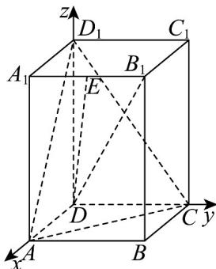

> [!faq]- 《专题04_空间向量的应用_五大题型__高效培优期中专项训练_数学人教A》官方解析
>
> > [!success]- **【答案】** D
>
> > [!note]- **【分析】**
> > 根据给定条件，建立空间直角坐标系，利用点到直线的距离公式求解
>
> > [!note]- **【解析】**
> > 在正四棱柱 $ABCD - A_{1}B_{1}C_{1}D_{1}$ 中，建立如图所示的空间直角坐标系，
> > 由 $AB = 1, AA_{1} = 2$ ，得 $D(0,0,0), B(1,1,0)$ ，线段 $A_{1}B_{1}$ 的中点 $E(\frac{1}{2}, 2)$ ，
> > 则 $\overline{DE}=(1,\frac{1}{2},2),\overline{DB}=(1,1,0)$
> >
> > 所以点到直线的距离 $h = \sqrt{\left|\overrightarrow{DB}\right|^2 - \left(\frac{\overrightarrow{DE} \cdot \overrightarrow{DB}}{\overrightarrow{DE}}\right)^2} = \sqrt{2 - \left(\frac{\frac{3}{2}}{\frac{\sqrt{21}}{2}}\right)^2} = \frac{\sqrt{77}}{7}$
> >
> > 故选：D
> >
> > 
