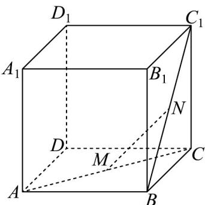

> [!faq]- 《专题04_空间向量的应用_五大题型__高效培优期中专项训练_数学人教A》官方解析
>
> > [!success]- **【答案】** B
>
> > [!note]- **【分析】**
> > 设 M 为直线 AC 上任意一点，过 M 作 $MN \perp BC_{1}$ ，垂足为 N，利用向量 $\overline{AB}, \overline{AD}, \overline{AA}_{1}$ 表示 $\overline{MN}$ ， $\overline{BC}_{1}$ ，再结合向量模的性质求 $\left|MN\right|$ 的最小值，由此可得结论：
>
> > [!note]- **【解析】**
> > 设 M 为直线 AC 上任意一点，过 M 作 $MN \perp BC_{1}$ ，垂足为 N，
> >
> > 
> >
> > 设 $\overline{AM} = \lambda \overline{AC} = \lambda \overline{AB} + \lambda \overline{AD}$ ， $\overline{BN} = \mu \overline{BC}_{1} = \mu \overline{AD} + \mu \overline{AA}_{1}$
> >
> > 则 $MN = AN - AM = AB + BN - AM = (1 - \lambda)AB + (\mu - \lambda)AD + \mu AA_{1}$ $BC_{1}=AD+AA_{1}$
> >
> > 因为 $MN \perp BC_{1}$ ，所以 $MN \cdot BC_{1} = 0$
> >
> > 即 $\left[(1 - \lambda)AB + (\mu -\lambda)AD + \mu AA_1\right]\cdot \left( \overline{A} D + \overline{AA}_1\right) = 0$
> >
> > 所以 $\left(\mu-\lambda\right)AD^{2}+\mu AA_{1}^{2}=0$ ，所以 $\mu-\lambda+\mu=0$ ，
> >
> > 所以 $\lambda = 2\mu$
> >
> > $$
> > M N = (1 - 2 \mu) A B - \mu A D + \mu A A _ {1}
> > $$
> >
> > $$
> > \left| \overline {{M N}} \right| = \left| (1 - 2 \mu) A B - \mu A D + \mu A A _ {1} \right| = \sqrt {\left| (1 - 2 \mu) A B - \mu A D + \mu A A _ {1} \right| ^ {2}}
> > $$
> >
> > $$
> > = \sqrt {(1 - 2 \mu) ^ {2} + \mu^ {2} + \mu^ {2}} = \sqrt {6 \mu^ {2} - 4 \mu + 1} = \sqrt {6 \left(\mu - \frac {1}{3}\right) ^ {2} + \frac {1}{3}}
> > $$
> >
> > ∴当 $\mu=\frac{1}{3}$ 时， $\left|MN\right|$ 取得最小值 $\sqrt{\frac{1}{3}}=\frac{\sqrt{3}}{3}$
> >
> > 故直线 $AC$ 与 $BC_{1}$ 之间的距离是 $\frac{\sqrt{3}}{3}$ .
> >
> > 故选 **B**.
