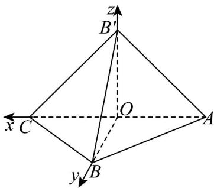

> [!faq]- 《专题04_空间向量的应用_五大题型__高效培优期中专项训练_数学人教A》官方解析
>
> > [!success]- **【答案】** (1)证明见解析 (2) $\left[\frac{1}{6},\frac{4}{9}\right]$
>
> > [!note]- **【分析】**
> > （1）利用等腰三角形的性质证明 $\angle B^{\prime}OC = 90^{\circ}$ ，再利用三角形全等证明 $\angle B^{\prime}OB = \angle B^{\prime}OC = 90^{\circ}$ 由线面垂直的判定定理和面面垂直的判定定理证明即可；
> >
> > (2) 利用向量的坐标运算求出 $BM$ ， $AN$ 的坐标，然后利用向量垂直的坐标表示，得到 $\lambda, \mu$ 的函数关系，利用单调性求解取值范围即可。
>
> > [!note]- **【解析】**
> > （1）取 AC 的中点为 O，连接 OB，OB'，
> >
> > 由题意得 $BB' = AB = AB' = BC = B'C$
> >
> > 在 $\mathrm{V}AB^{\prime}C$ 中，因为 $O$ 为 $AC$ 的中点，所以 $OB^{\prime}\perp AC$ ，即 $\angle B^{\prime}OC = 90^{\circ}$
> >
> > 因为 $OB^{\prime} = OC = OB$ ，且 $BB^{\prime} = B^{\prime}C$
> >
> > 所以 $\triangle OBB'$ 与 $\triangle OCB'$ 全等，则 $\angle B'OB = \angle B'OC = 90^{\circ}$ ，即 $B'O \perp OB$ .
> >
> > 又 $AC \cap OB = O$ ， $AC, OB \subset$ 平面 $ABC$
> >
> > 所以 $B \Phi O^{\wedge}$ 平面 $ABC$
> >
> > 因为 $B'O \subset$ 平面 $AB'C$ ，所以平面 $AB'C \perp$ 平面 ABC。
> >
> > (2) 不妨设 $OA = 1$ ，旋转过程中， $OB \perp AC$ 不变·如图，以 $O$ 为坐标原点，分别以 $OC$ ， $OB, OB'$ 所在直线为 $x$ 轴、 $y$ 轴、 $z$ 轴，建立空间直角坐标系，则 $O(0,0,0)$ ， $A(-1,0,0)$ ， $B(0,1,0)$ ， $B'(0,0,1)$ ， $C(1,0,0)$ ，于是 $BC = (1,-1,0)$ ， $CB' = (-1,0,1)$ ， $AB = (1,1,0)$ ， $BB' = (0,-1,1)$ .
> >
> > 
> >
> > $$
> > \stackrel {\square \square \square} {B M} = \stackrel {\square \square \square} {B C} + \stackrel {\square \square \square} {C M} = \stackrel {\square \square \square} {B C} + \mu \stackrel {\square \square \square} {C B ^ {\prime}} = (1, - 1, 0) + \mu (- 1, 0, 1) = (1 - \mu , - 1, \mu)
> > $$
> >
> > $AN = AB + BN = AB + \lambda BB' = (1,1,0) + \lambda (0, - 1,1) = (1,1 - \lambda ,\lambda)$
> >
> > 因为 $BM \perp AN$ ，所以 $BM \cdot AN = 0$
> >
> > 得 $(1 - \mu) - (1 - \lambda) + \mu \lambda = 0$ ，即 $\lambda = 1 - \frac{1}{1 + \mu}$
> >
> > 则 $\lambda$ 是关于 $\mu$ 的增函数，当 $\mu \in \left[\frac{1}{5},\frac{4}{5}\right]$ 时， $\lambda \in \left[\frac{1}{6},\frac{4}{9}\right]$
> >
> > 故 $\lambda$ 的取值范围是 $\left[\frac{1}{6},\frac{4}{9}\right]$ .
