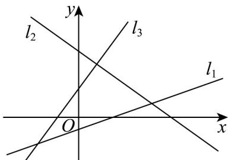

<!-- question-source:start -->
1. 如图，直线 $l_{1}$ 、 $l_{2}$ 、 $l_{3}$ 的斜率分别为 $k_{1}$ 、 $k_{2}$ 、 $k_{3}$ ，则（）

A $k_{2} < k_{1} < k_{3}$

C $k_{3} < k_{2} < k_{1}$

B $k_{3} < k_{1} < k_{2}$

D $k_{1} < k_{2} < k_{3}$
<!-- question-source:end -->

![[高中/课堂同步/题库/人教A版高中数学同步讲义(2026)/03_选择性必修第一册/期中专项训练+期中模拟卷/专项训练/专题05_直线的倾斜角与斜率_六大题型__高效培优期中专项训练_高二数/_compact/answers/Q00062259A1.md]]
