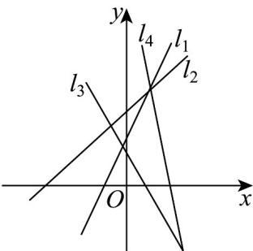

<!-- question-source:start -->
3. 如图，若直线 $l_{1}, l_{2}, l_{3}, l_{4}$ 的斜率分别为 $k_{1}, k_{2}, k_{3}, k_{4}$ ，则（）

A. $k_{4} < k_{3} < k_{2} < k_{1}$ B. $k_{4} < k_{3} < k_{1} < k_{2}$ C. $k_{3} < k_{4} < k_{2} < k_{1}$ D. $k_{4} < k_{2} < k_{3} < k_{1}$
<!-- question-source:end -->

![[高中/课堂同步/题库/人教A版高中数学同步讲义(2026)/03_选择性必修第一册/期中专项训练+期中模拟卷/专项训练/专题05_直线的倾斜角与斜率_六大题型__高效培优期中专项训练_高二数/_compact/answers/Q00062260A1.md]]
