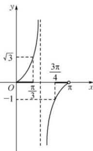

> [!faq]- 《专题05_直线的倾斜角与斜率_六大题型__高效培优期中专项训练_高二数》官方解析
>
> > [!success]- **【答案】** C
>
> > [!note]- **【分析】**
> > 利用斜率的定义得到直线倾斜角的正切值的范围，再利用正切函数的性质即可得解
>
> > [!note]- **【解析】**
> > 设 $l$ 的倾斜角为 $\theta$ ，则 $\theta \in [0,\pi)$ ，且 $k = \tan \theta \in [-1,\sqrt{3} ]$
> >
> > 如图，由正切函数的性质知 $\theta \in \left[0, \frac{\pi}{3}\right] \cup \left[\frac{3\pi}{4}, \pi\right)$ .
> >
> > 
> >
> > 故选 **C**.
