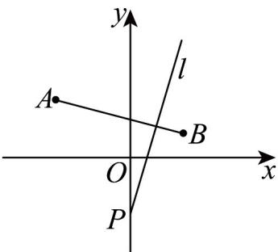

> [!faq]- 《专题05_直线的倾斜角与斜率_六大题型__高效培优期中专项训练_高二数》官方解析
>
> > [!success]- **【答案】** A
>
> > [!note]- **【分析】**
> > 求出直线 PA、PB 的斜率后即可求直线/的斜率的范围·
>
> > [!note]- **【解析】**
> > 如图所示：
> >
> > 
> >
> > $$
> > k _ {P A} = \frac {- 1 - 2}{0 + 3} = - 1
> > $$
> >
> > ，而
> >
> > $$
> > k _ {P B} = \frac {- 1 - 1}{0 - 2} = 1
> > $$
> >
> > 故直线 l 的取值范围为 $(-∞, -1] ∪ [1, +∞)$ .
> >
> > 故选 **A**.
