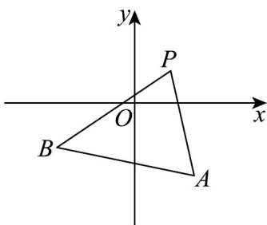

> [!faq]- 《专题05_直线的倾斜角与斜率_六大题型__高效培优期中专项训练_高二数》官方解析
>
> > [!success]- **【答案】** B
>
> > [!note]- **【分析】**
> > 首先求出直线 PA 、 PB 的斜率，然后结合图象即可写出答案.
>
> > [!note]- **【解析】**
> > 记 $(1,1)$ 为点P，直线PA的斜率 $k_{PA}=\frac{-3-1}{2-1}=-4$ ，直线PB的斜率 $k_{PB}=\frac{-2-1}{-3-1}=\frac{3}{4}$ ，
> > 因为直线 l 过点 $P(1,1)$ ，且与线段 AB 相交，
> > 结合图象，可得直线 l 的斜率 k 的取值范围是 $(-∞,-4]∪\left[\frac{3}{4},+∞\right)$ .
> >
> > 
> >
> > 故选 **B**.
