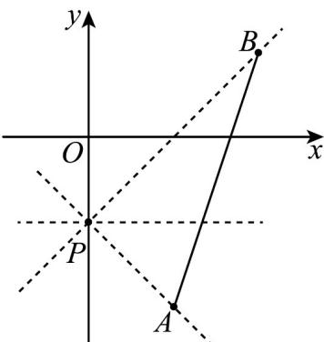
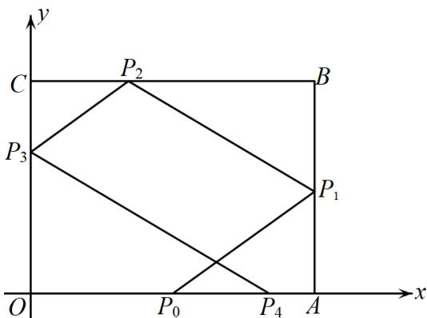

> [!faq]- 《专题05_直线的倾斜角与斜率_六大题型__高效培优期中专项训练_高二数》官方解析
>
> > [!success]- **【答案】** A
>
> > [!note]- **【分析】**
> > 作出图形，求出 $PA, PB$ 的斜率，数形结合可求得直线 $l$ 的斜率的取值范围，再由斜率与倾斜角的关系可求出倾斜角的取值范围·
>
> > [!note]- **【解析】**
> > 如图所示，直线 $PA$ 的斜率 $k_{PA} = \frac{-2 + 1}{1 - 0} = -1$ ，直线 $PB$ 的斜率 $k_{PB} = \frac{1 + 1}{2 - 0} = 1$
> >
> > 由图可知，当直线 $l$ 与线段 $AB$ 有交点时，直线 $l$ 的斜率 $k \in [-1,1]$
> >
> > 因此直线 $l$ 的倾斜角的取值范围是 $\left[0, \frac{\pi}{4}\right] \cup \left[\frac{3\pi}{4}, \pi\right)$
> >
> > 故选：A.
> >
> > 
> >
> > 28. 矩形 $OABC$ 中， $O$ 为坐标原点， $B(8,6)$ ，光线从 $OA$ 边上一点 $P_0(4,0)$ 发出，到 $AB$ 边上的点 $P_1$ ，被 $AB$ 反射到 $BC$ 上的点 $P_2$ ，再被 $BC$ 反射到 $OC$ 上的点 $P_3$ ，最后被 $OC$ 反射到 $x$ 轴上的点 $P_4(t,0)$ ，若 $t \in (4,8)$ ，则 $P_0P_1$ 与 $x$ 轴夹角的正切值的取值范围是 \_\_\_\_.
> >
> > 
> >
> > 【答案】 $\left(\frac{3}{5},\frac{3}{4}\right)$
> >
> > 【分析】设 $P_{0}P_{1}$ 与 $x$ 轴夹角为 $\theta$ ，根据入射光线与反射光线的关系，逐步用 $\tan \theta$ 表示出 $t$ ，再根据 $t$ 的范围可求 $\tan \theta$
> >
> > 【详解】设 $P_{0}P_{1}$ 与 $x$ 轴夹角为 $\theta$ ，由题意可知， $\angle AP_{0}P_{1} = \angle BP_{2}P_{1} = \angle CP_{2}P_{3} = \angle OP_{4}P_{3} = \theta$ 所以 $\left|AP_1\right| = \left|AP_0\right|\tan \theta = 4\tan \theta$ ，所以 $\left|BP_1\right| = \left|AB\right| - \left|AP_1\right| = 6 - 4\tan \theta$ 所以 $\left|BP_2\right| = \frac{\left|BP_1\right|}{\tan\theta} = \frac{6 - 4\tan\theta}{\tan\theta}$ ，所以 $\left|CP_2\right| = \left|BC\right| - \left|BP_2\right| = 8 - \frac{6 - 4\tan\theta}{\tan\theta} = 12 - \frac{6}{\tan\theta}$ 所以 $\left|CP_3\right| = \left|CP_2\right|\tan \theta = 12\tan \theta -6$ ，所以 $\left|OP_3\right| = \left|OC\right| - \left|CP_3\right| = 12 - 12\tan \theta$ 所以 $\left|OP_4\right| = \frac{\left|OP_3\right|}{\tan\theta} = \frac{12}{\tan\theta} -12 = t\in (4,8)$ ，所以 $\tan \theta \in \left(\frac{3}{5},\frac{3}{4}\right)$
> >
> > 故答案为： $\left(\frac{3}{5},\frac{3}{4}\right)$
