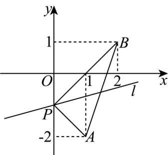

> [!faq]- 《专题05_直线的倾斜角与斜率_六大题型__高效培优期中专项训练_高二数》官方解析
>
> > [!success]- **【答案】** C
>
> > [!note]- **【分析】**
> > 由题知 $-1 \leq k \leq 1$ ，再根据斜率范围求解倾斜角的范围即可.
>
> > [!note]- **【解析】**
> > 
> >
> > 设直线 $l$ 的斜率为 $k$ ，直线 $l$ 的倾斜角为 $\alpha$ ，则 $0 \leq \alpha < \pi$
> >
> > 因为直线 $PA$ 的斜率为 $\frac{-1 - (-2)}{0 - 1} = -1$ ，直线 $PB$ 的斜率为 $\frac{-1 - 1}{0 - 2} = 1$
> >
> > 因为直线 l 经过点 $P(0,-1)$ ，且与线段 AB 总有公共点，
> >
> > 所以 $-1 \leq k \leq 1$ ，即 $-1 \leq \tan \alpha \leq 1$
> >
> > 因为 $0 \leq \alpha < \pi$
> >
> > 所以 $0 \leq \alpha \leq \frac{\pi}{4}$ 或 $\frac{3\pi}{4} \leq \alpha < \pi$
> >
> > 故直线 $l$ 的倾斜角的取值范围是 $\left[0, \frac{\pi}{4}\right] \cup \left[\frac{3\pi}{4}, \pi\right)$
> >
> > 故选 **C**.
