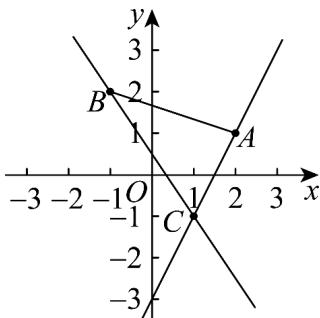

> [!faq]- 《专题05_直线的倾斜角与斜率_六大题型__高效培优期中专项训练_高二数》官方解析
>
> > [!success]- **【答案】** B
>
> > [!note]- **【分析】**
> > 画出草图，先求出直线 $AC$ 和直线 $BC$ 的斜率，直线 $l$ 与线段 $AB$ 有公共点时，找出直线 $l$ 的斜率的临界状态即可·
>
> > [!note]- **【解析】**
> > 运用两点间的斜率公式， $k_{AC} = \frac{-1 - 1}{1 - 2} = 2$ ， $k_{BC} = \frac{-1 - 2}{1 - (-1)} = -\frac{3}{2}$ ，过点 $C$ 的直线 $l$ 与线段 $AB$ 有公共点时，如图所示，直线 $l$ 斜率的取值范围是 $(- \infty, -\frac{3}{2}] \cup [2, +\infty)$ .
> >
> > 
> >
> > 故选：B.
> >
> > ## 考点 04 由斜率判断两直线平行关系
