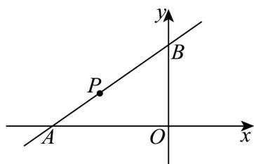

> [!faq]- 《专题06_直线方程考点全方位总结_六大题型__高效培优期中专项训练_高》官方解析
>
> > [!success]- **【答案】** (1) $y = -\frac{1}{2} x$ 或 $x + y + 2 = 0$ (2)16 $x - 2y - 8 = 0$
>
> > [!note]- **【分析】**
> > （1）截距相等时，要考虑到截距为0和不为0两种情况分类讨论；
> >
> > (2) 设直线方程为点斜式，表示直角三角形的面积，通过基本不等式即可求得最值.
>
> > [!note]- **【解析】**
> > （1）当截距为0时，设直线方程为 $y = kx$
> >
> > 因为直线过点 $P(-4,2)$ ，则 2 = -4k，
> >
> > 解得 $k = -\frac{1}{2}$
> >
> > 所以直线方程为 $y = -\frac{1}{2}x$ ;
> >
> > 当截距相等且不为0时，设直线方程为 $\frac{x}{a} +\frac{y}{a} = 1$
> >
> > 因为直线过点 $P(-4,2)$ ，则代入直线方程得， $a = -2$ ，
> >
> > 则直线方程为 $x + y + 2 = 0$ .
> >
> > 所以直线方程为 $y = -\frac{1}{2}x$ 或 $x + y + 2 = 0$ .
> >
> > (2) 由题意可知，直线的截距不为 0，且斜率存在且 k > 0
> >
> > 设直线方程为 $y - 2 = k(x + 4)$
> >
> > 令 $x = 0$ ， $y = 4k + 2$ ；令 $y = 0, x = -\frac{4k + 2}{k}$
> >
> > 
> >
> > 则 $S_{\triangle AOB} = \frac{1}{2}\left|x\right|y = \frac{1}{2}\frac{(4k + 2)^2}{k} = \frac{8k^2 + 8k + 2}{k} = 8k + \frac{2}{k} + 8$ $2\sqrt{8k\times\frac{2}{k}} +8 = 16$
> >
> > 当且仅当 $k = \frac{1}{2}$ 时，等号成立·
> >
> > 所以 S 的最小值为 16，此时的直线方程为 $x - 2y + 8 = 0$ .
