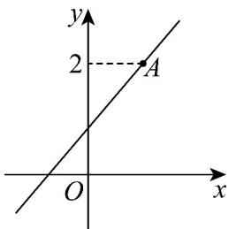
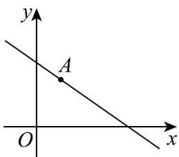

> [!faq]- 《专题06_直线方程考点全方位总结_六大题型__高效培优期中专项训练_高》官方解析
>
> > [!success]- **【答案】** (1)(1,2) (2) $\left[\frac{3}{2},+\infty\right)$ (3) $2x + y - 4 = 0$
>
> > [!note]- **【分析】**
> > （1）由方程变形可得 $a(2x - y) - 3x + y + 1 = 0$ ，列方程组，解方程即可；
> >
> > (2) 数形结合，结合直线图象可得出关于实数 a 的不等式，解之即可；
> >
> > (3) 求得直线与坐标轴的交点，可得面积，进而利用二次函数的性质可得最值.
>
> > [!note]- **【解析】**
> > （1）由 $l:(a - 1)y = (2a - 3)x + 1$ ，即 $a(2x - y) - 3x + y + 1 = 0$
> >
> > 则 $\left\{ \begin{array}{l} 2x - y = 0 \\ -3x + y + 1 = 0 \end{array} \right.$ ，解得 $\left\{ \begin{array}{l} x = 1 \\ y = 2 \end{array} \right.$ ，所以直线过定点 $(1,2)$
> >
> > (2) 因为直线 $l$ 不过第四象限，结合图形可知，直线 $l$ 的斜率存在，所以 $a \neq 1$
> >
> > 此时，直线 $l$ 的方程可化为 $y = \frac{2a - 3}{a - 1} x + \frac{1}{a - 1}$ ，记点 $A(1,2)$ ，则 $k_{OA} = 2$ ，
> >
> > 
> >
> > 由图可得 $0 \leq \frac{2a - 3}{a - 1} \leq 2$ ，解得 $a = \frac{3}{2}$ ，因此，实数 $a$ 的取值范围是 $\left[\frac{3}{2}, +\infty\right)$ .
> >
> > (3) 已知直线 $l:(a-1)y=(2a-3)x+1$ ，且由题意知 $a \neq 1$ ，
> >
> > 
> >
> > 令 x=0 ，得 $y=\frac{1}{a-1}>0$ ，得 a>1 ，
> >
> > 令 $y = 0$ ，得 $x = \frac{1}{3 - 2a} >0$ ，得 $a <   \frac{3}{2}$
> >
> > $$
> > S = \frac {1}{2} \times \frac {1}{a - 1} \times \frac {1}{3 - 2 a} = \frac {1}{- 4 a ^ {2} + 1 0 a - 6} = \frac {1}{- 4 \left(a - \frac {5}{4}\right) ^ {2} + \frac {1}{4}}
> > $$
> >
> > 所以当 $a = \frac{5}{4}$ 时，S取最小值，
> >
> > 此时直线 $l$ 的方程为 $\left(\frac{5}{4} - 1\right)y = \left(2 \times \frac{5}{4} - 3\right)x + 1$ ，即 $2x + y - 4 = 0$ .
> >
> > 53. 直线 $mx + (3m - 1)y + 1 = 0$ 必过定点（ ）A. $(3,1)$ B. $(-3,1)$ C. $\left(\frac{1}{3},1\right)$ D. $\left(\frac{1}{3},0\right)$
> >
> > 【答案】B
> >
> > 【分析】将直线分离参数为 $m(x + 3y) + (1 - y) = 0$ ，令 $\left\{ \begin{array}{l}x + 3y = 0\\ 1 - y = 0 \end{array} \right.$ ，可得定点
> >
> > 【详解】根据题意，直线 $mx + (3m - 1)y + 1 = 0$
> >
> > 即 $m(x + 3y) + (1 - y) = 0$
> >
> > 令 $\left\{\begin{aligned}x+3y&=0\\ 1-y&=0\end{aligned}\right.$ ，得 $\left\{\begin{aligned}x&=-3\\ y&=1\end{aligned}\right.$ ，
> >
> > 故直线 $mx + (3m - 1)y + 1 = 0$ 必过定点 $(-3, 1)$ .
> >
> > 故选 **B**
