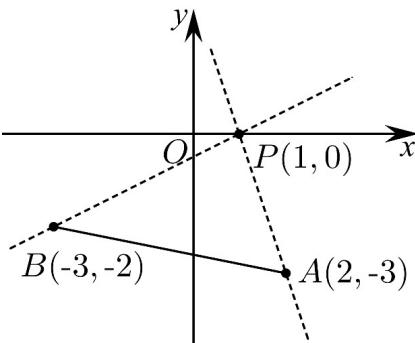

> [!faq]- 《专题06_直线方程考点全方位总结_六大题型__高效培优期中专项训练_高》官方解析
>
> > [!success]- **【答案】** ACD
>
> > [!note]- **【分析】**
> > 根据条件，结合 $(1,k)$ 也是直线的方向向量计算k的值即可判断 $^{A}$ ；根据两直线互相垂直计算参数a的值即可判断 $^{B}$ ；根据直线恒过定点Q可知当直线与PQ垂直时，点P到直线的距离最大即可判断 $^{C}$ ；计算直线PA,PB的斜率，结合图象确定直线l斜率的取值范围即可判断D.
>
> > [!note]- **【解析】**
> > 对于 A 选项，若直线的一个方向向量为 $(2,3)$ ，则该直线的斜率为 $k=\frac{3}{2}$ ，A 对；
> >
> > 对于 $^{B}$ 选项，由两直线互相垂直得， $a^{2}\times1+(-1)\times(-a)=0$ ，解得a=-1或a=0。
> >
> > 可知“ $a = -1$ ”是两直线垂直的充分不必要条件，B错；
> >
> > 对于 $C$ 选项，将直线方程变形为 $y - 1 = m(x - 2)$ ，由 $\left\{ \begin{array}{l} x - 2 = 0 \\ y - 1 = 0 \end{array} \right.$ 可的 $\left\{ \begin{array}{l} x = 2 \\ y = 1 \end{array} \right.$ ，
> >
> > 所以，直线 $mx - y + 1 - 2m = 0$ 过定点 $Q(2,1)$
> >
> > 当直线 $mx - y + 1 - 2m = 0$ 与 $PQ$ 垂直，点 $P(3,2)$ 到直线 $mx - y + 1 - 2m = 0$ 的距离最大，
> >
> > 因为 $k_{PQ}=\frac{2-1}{3-2}=1$ ，则 $m=-\frac{1}{k_{PQ}}=-1$ ，C 对；
> >
> > 对于 D 选项，如图，
> >
> > 
> >
> > ，，所以由图可知，或 $k_{PA}=\frac{-3-0}{2-1}=-3$ $k_{PB}=\frac{-2-0}{-3-1}=\frac{1}{2}$ $k=\frac{1}{2}$ $k\leq-3$
> >
> > 则斜率 $k$ 的取值范围是 $\left(-\infty, -3\right]\mathrm{U}\left[\frac{1}{2}, +\infty\right)$ ，D对.
> >
> > 故选 **ACD**.
